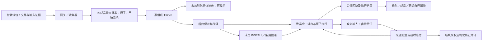

# Next：基于直接担保的可续花 UTXO 快速支付系统

> **系统设计与证明建模基线 · wire 4 · 2026-09-26**
>
> 本文按可执行源码基线 `918acd3d56617cf0517466d8330784f4973bf9f2` 重建现行协议；后续文档提交 `1a2eed0`、`cd176fc` 未改变这些源码。不以旧设计中的计划功能代替实现。本文定义对象、状态、原子转移及证明边界；安全性质是待论证目标，不是已完成的形式化证明。代码与测试映射见[工程架构](architecture.md)，实验数字见[实验索引](../experiments/README.md)。

## 1. 设计目标与核心思想

Next 让收款人在公共账本确认之前，取得一个具体 CAL 输出及其组织认证 TXCer，并用它继续付款。交易双方不需要事先建立双边支付通道；跨组织付款使用统一的输出、授权和凭证格式。

系统把付款拆成三个相互衔接的过程：

1. **先交付可续花权利。** 成员独立验证并原子占用输入和权限，三份匹配签名构成 TXCer。收款钱包验证、接收后即可构造下一笔付款，不等待后台 INSTALL。
2. **以直接责任支持公共执行。** 委员会处理当前交易；合法直接输入暂未成立时，原子记录缺口及其发行组织责任，同时执行当前交易。不要求先收齐祖先交易或按整条依赖链排序。
3. **以后续事实关闭责任。** 来源交易成立则正常履行；超时则由原发行组织真实赔付，并授权受限修改历史输入的资金引用。钱包和成员自行跟块更新币与权限。

“快速”指提前获得下一次支付所需的材料，不表示凭证已经是最终 UTXO，也不表示任何负载、预算和故障条件下都能立即完成下一次取证。后台仍承担公共执行、费用和异常处理工作。

研究对象是**便捷、可续花、可兑现的快速支付**。候选贡献在于上述机制的结合及其可验证状态关系；UTXO、三票认证、CometBFT、变色龙哈希、无双边通道分别不能单独作为首次创新主张。

## 2. 系统模型与假设

### 2.1 参与方

| 参与方 | 权限与职责 |
| --- | --- |
| 钱包 | 持有所有者密钥，选择输入、签署交易；验证输出与 TXCer，保存接收和消费状态 |
| 组织 G 的四名成员 | 独立裁决分配给 G 的输入消费，记录本地批准及资源占用，签发组织票 |
| 网关／收集器 | 并行分发、收集三票、交付结果和安排后台传播；不能独立授权资金 |
| 四节点委员会 | 以 BFT 确定公共命令顺序，执行资金、消费、费用、责任与修订规则 |
| 中继／跟块器 | 提交完整交易材料、复制证书；验证公共块及结果并更新本地状态 |
| 补资管理者（可选） | 从已有资金账户转入 CAL，增加指定授权；不能凭空创造资金 |

每个组织独立采用 `n=4, q=3, f≤1` 的成员模型。委员会故障上限单独设定，不能把组织三票与委员会共识视为同一个信任集合。组织配置绑定网络、组织、epoch、四个成员公钥；当前使用静态预置可信配置，不包含首次通信自动发现、动态成员变更或开放注册。

钱包使用所有者签名的收款描述 `ReceiveDescriptor`，绑定所有者和输出消费路由。`OrgRoute(G)` 指定下一次消费由 G 裁决，不是资产进出域或支付通道。付款组织可以创建路由至另一组织的输出，而该输出的 TXCer 责任仍属于原发行组织。

当前快速交易的 CAL 输入均须由本次签发组织裁决；**一笔交易原子混合不同消费组织的输入不在现行快速路径内**。结构中存在委员会路由和历史慢速方向，但本文不把未经同等核验的散户兼容路径纳入已建模的 wire 4 快速协议。

### 2.2 安全与进度假设

安全模型需要固定以下前提：可信创世与规则配置；所有者和成员签名不可伪造；哈希及门限变色龙承诺满足相应安全性质；诚实成员不遗忘、回滚或擅自释放已签占用；委员会在其故障模型内提供一致顺序。资金授权还必须有真实、不重复分配的备付支持，不能仅凭配置中的额度数字推出偿付能力。

消息可以延迟、重复、乱序或丢失。最终推进另外要求足够成员在线、网络最终可达、材料可得、存在持续投递者、资金与 Worker 额度可用、委员会和跟块器继续工作。这些是活性条件，不由签名正确性自动推出。

当前成员可执行路径默认使用 bbolt NoSync，可另选实验内存模式；两者都保留运行期间的原子性、输入锁和防重记录，但不提供掉电耐久恢复保证。状态丢失后继续用同一身份签署不属于“诚实且不遗忘”的模型。门限材料采用可信离线初始化；没有实现 DKG。

### 2.3 初始状态与配置边界

一次全新实验从共同创世开始：预置最终输出、真实账户余额、Grant、组织配置、委员会集合、费用／工作规则和修订公钥；输出身份唯一，初始实例为 0。批准、输入消费、直接责任、费用进度与修订记录初始为空。成员只装入属于自己的 Grant，按份额初始化各 Worker 的 Available，Reserved 为 0。

成员初始化摘要绑定创世、组织、规则、成员索引、Worker 布局、委员会信任和修订公钥；已有存储与摘要不符会拒绝复用。钱包接入当前实验网络时装入相应所有者密钥和可信配置，接收描述由所有者签署；不需要创建双边通道。

委员会创世加载已按真实 CAL／FUEL 账户汇总各 Grant 的金额，拒绝总授权超过相应余额；多个 Grant 共享同一账户也参与汇总。形式模型应包含这一初始约束。它不等于运行期全局偿付证明：后续仍须论证覆盖占用与释放、实际赔付、增量补资和成员重叠授权之间的关系。

## 3. 协议对象与身份

### 3.1 输出、交易和凭证

| 对象 | 定义及关键约束 |
| --- | --- |
| `Output` | 网络、资产、金额、所有者、消费路由等正文；当前快速本金为 CAL |
| `InputClaim` | 声称消费的输出正文及 `Instance`；需与输入标识、证据和所有者授权一致 |
| `FastTx` | 付款正文 `Body`、输入声明 `Claims`、输入承诺 `Commitments`、资金引用 `Funding`、所有者签名 `Auth` |
| `OutputSummary` | 网络、稳定 TxID、发行组织、配置／epoch／规则、全部输出摘要与金额、准入向量和 Grant |
| `OutputCertificate`（TXCer） | `OutputSummary + SpendQC`；三名不同成员对同一事实签名 |
| `DirectRequest` | 交易及其直接输入证书，提交给成员取证 |
| `DirectPayment`，405 | 内存对象含本次 TXCer；线上编码交易、Admission、QC 和直接输入材料，解码重构本次 TXCer，用于组织保存／INSTALL |
| `DirectSubmission`，406 | 交易、准入向量、组织消费授权 QC 和直接输入证书，用于公共执行 |
| `RepairInput` | 针对确定历史位置、版本与缺口的赔付及修订命令 |
| `ReserveIncrease`，420 | 从真实来源账户转资并增加既有 Grant 的管理命令 |

TXCer 不包含输出正文，但承诺本交易**所有输出**的摘要和金额。收款人必须把正文与对应摘要、索引、网络和发行配置一起验证，不能只验证脱离输出的组织签名。它也不是新增一份 CAL。

当前 `SpendQC` 是带成员索引的独立 Ed25519 签名集合，不是聚合组织公钥签名。跨组织可以缓存配置和已验证静态证据，仍须验证本次授权、金额、路由与最新消费状态。

解码和结构合法性检查不等于认证。`DecodeOutputCertificate` 检查编码和摘要约束；钱包、成员和公共规则仍须调用 `Verify`／`VerifyOutput` 验证配置、成员签名及输出绑定。

公共封装不带本次新 `OutputCertificate` 对象，但仍保留同一取证过程产生的组织 QC。委员会重算摘要并验证授权；“不提交新 TXCer”不意味着取消组织认证或完全不处理担保证据。

### 3.2 稳定身份与可修订部分

忽略编码长度前缀，下式表示身份关系；准确字节编码以 `protocol` 为准：

`Core(T) = Encode(Body, Claims)`

`TxID(T) = H("TX_V3", Core(T), Commitments)`

`Fact(T) = H("DIRECT_CERT_V3", Encode(OutputSummary(T)))`

`OutputID(T,j) = H(Network, TxID(T), j)`

`SpendKey = (OutputID, Instance)`

`Auth` 签署稳定 TxID；`Funding` 和签名字节本身不进入 TxID。每个输入的变色龙承诺绑定其上下文与资金引用，初始只能使用指向原输出的 `OriginalFunding`。受限修订只改变指定 `Funding` 及其 opening，不改变 `Body`、输入声明、付款输出或原所有者授权。

因此 TxID 相同不代表报文完全相同。静态验证缓存必须绑定完整字节，修订也必须验证授权和可变范围，不能只比较哈希相等。

通常输出使用 `Instance=0`。仅在已赔付后原交易合法迟到的特定输出上创建 `Instance=1`；后者只能作为已最终输入使用，不能凭原 TXCer 提前消费。

## 4. 架构与五类状态

形式模型可以聚合存储键，但必须保留以下状态之间的区别：

| 状态类 | 最少内容 |
| --- | --- |
| 钱包权利 W | 输出正文、TXCer 或最终创建事实、实例号、本地消费标记 |
| 成员状态 L | 输入候选／已消费、Intent 绑定、批准记录、各 Worker 资源、累计跟块进度 |
| 证据与待办 E | 完整请求／QC 的可得位置、INSTALL、公共投递待办；不是公共资金终态 |
| 公共经济状态 K | 创建与消费、账户、Grant 使用、付款进度、费用、覆盖记录、输出承诺和直接义务 |
| 历史验证状态 V | 原始区块／结果、后继承诺、已授权修订及版本、实际物化进度 |

### 4.1 公共责任状态不能合并成一张“等待表”

| 状态 | 索引与含义 |
| --- | --- |
| `Coverage` | 按证书事实登记整张证书的 CAL 覆盖；记录 Original、Discharged、Paid、Remaining 和 Revision |
| `Promise` | 按该证书每个输出记录承诺状态；可能尚未被任何公共交易使用 |
| `DirectObligation` | 只有实际消费了缺失输出才建立；按该 OutputID 唯一记录发行组织、金额、消费位置、截止时间和状态 |
| `Payment` | 本次付款是否执行、其自身缺失输入数 Pending、生命周期费用 |
| `Creation / Consumed` | 分别记录输出是否成立及其实例是否已消费；存在创建记录不等于仍可花 |

覆盖记录满足的目标关系是 `Original = Discharged + Paid + Remaining`。`Remaining` 包括尚未解除的未消费输出承诺，不等于已发生的缺口总额。

`Coverage.Credit.Revision` 是覆盖状态的累计更新序号，正常履行和赔付都会增加；它不同于历史区块的修订版本。

缺口总量只累计 `Open` 的实际直接义务。凭证传播、重复提交、重复跟块都不能重复增加该值。

公共 Grant 使用状态区分 Reserved 与 Spent，准入检查 `Reserved + Spent ≤ Grant.Amount`。正常履行减少 Reserved；赔付将相应 Reserved 转成 Spent，同时真实账户扣款。Grant 数字、使用记录与真实账户必须分别保留在模型中。

## 5. 快速路径：一轮取证后可续花

### 5.1 准备与发送

付款钱包选择最终 CAL 输出，或者选择尚未最终输出并附对应 TXCer；再选择足够的最终 FUEL 支付费用，确定收款描述、费用上限和工作限额，签署交易。钱包原子记录请求与本地消费标记，同一付款重试复用原交易。

快速到账计时通常从钱包实际开始发送起算，构造与签名准备另计。各历史实验起点差异以报告为准。

### 5.2 MemberApprove：本地原子批准

成员独立验证规范字节、所有者签名、输出绑定、直接证书、金额守恒、规则和路由，计算资源向量。随后在**一个本地事务**内：

1. 已有同事实批准则幂等处理；Intent 绑定冲突交易或输入已被冲突占用则拒绝。
2. 最终输入检查本地已验证创建事实；未最终输入检查直接 TXCer 和该输入的候选、消费记录。
3. 检查用户最终 FUEL 输入及适用 Grant，为 CAL、费用输入和资源记录占用。
4. 保存批准、原始交易和扣占明细。事务成功之后才返回成员签名。

任一检查失败，不应用该请求的部分修改。成员间无需先对全组织交易序列达成共识；成员内部冲突资金更新仍须串行原子裁决。

局部批准是真实占用。没有取得完整三票不能据此超时解锁，也不能用单票候选输出继续付款。

### 5.3 Certify 与 FastReceive

网关并行请求四成员，验证返回票与同一摘要匹配，取得前三份有效票即交付。钱包验证可信配置、QC、输出正文与身份绑定、所有者，完成本地原子接收；此刻记为快速可用。

这里的“交付”是逻辑步骤，不代表网关向收款钱包主动推送。当前普通 HTTP 接口向请求方返回编码后的 TXCer；调用方把请求中的输出正文、输出索引和证书交给收款钱包的 `ReceiveDirect`。同机负载器在进程内完成接收，E7 则通过独立收款 HTTP 路径传递正文与证书。因此，网关返回时刻不等于收款钱包快速可用时刻。

完整证书允许收款人构造下一笔交易。正常交付不等待 INSTALL 回执，也不要求祖先上链；下一组织仍执行自己的输入及额度检查。

同组织和跨组织使用相同规则。同组织可减少重复解析和静态验签，跨组织凭直接证书识别原发行责任；两者都不跳过三票门槛、所有者授权或唯一消费。

### 5.4 后台传播与公共提交

HTTP 响应发出后，网关通过有界早发队列启动公共投递和成员 INSTALL，完整材料保存并行进行。INSTALL 提供完整证据副本，网关正常首投，成员在固定有限宽限后备用补投。

INSTALL 还在成员本地把 QC 对应的 CAL／FUEL 输入标为 Consumed，与完整材料及 outbox 一起原子保存，即使该成员没有为这笔付款签票也会约束后续冲突批准。它不新增本成员的原批准或返还额度，不改变公共账本余额；公开提交本身则只是投递。

以上是正常付款接口的路径。E2 的显式实验接口可以只取证、暂不启动公开投递；E5 的外置代理可以把响应推迟到三个成员保存副本或已验证公共成功。它们用于控制实验变量，不改变正常模式的交付条件。

HTTP 202 只表示接收，不能据此删除待办或永久取消重试。已验证公共成功事实才结束待办；迟到保存和 INSTALL 不能复活已完成任务。

提前交付扩大了“已交付、完整材料尚未复制”的窗口。推进需要完整交易及证据仍可获得并有人持续提交；不能从钱包持有输出 TXCer 推出其他节点必然能重建完整原交易。

## 6. 公共路径：立即执行与直接缺口

### 6.1 ExecuteDirect：一个原子状态转移

委员会预检可并行；公共执行按共识顺序读取最新状态。每笔规则调用在自己的 Overlay 内计算以下不可拆的业务变化，成功 Transition 经引擎追加执行位置后，依次合入块级 Overlay；块末由 Commit 一次应用。拒绝不合并该笔变化，不留下半笔资金或责任记录。这是原子效果的对应关系，并非各层共用同一个 Go Overlay 对象。

- 核对组织 QC、规则、准入向量及直接输入证书，处理已执行事实和 Intent 防重。
- 检查资源与费用；用户自付时消费最终 FUEL 并建立费用托管。
- 逐输入检查唯一消费。来源最终成立则校验正文和证据并消费；来源缺失则必须有匹配的实例 0 直接 TXCer。
- 对缺失输入，首次引入其证书时登记**整张证书**的 Coverage 和各输出 Promise；只对实际使用的缺失输出建立 DirectObligation，增加当前付款的 Pending。
- 同一转移中标记输入消费，建立本交易最终输出，记付款 Settled，并推进费用阶段。

**不能把责任登记异步到输出生效之后。** 并行可以用于预解析、验签和后台物化，不能让账本先产生没有相应消费／缺口记录的可见输出。

普通交易执行时，其本次新输出不会自动登记一份新 CAL Coverage。只有未来有人以该 TXCer 消费仍缺失的输出时才触发登记。成员对新输出的本地预留与委员会按需登记不是同一个时点。

### 6.2 为什么不需要等待祖先

设 P 的输出被 C 使用，C 的输出再被 D 使用。委员会先收到 D，可以记录 C 输出的直接义务并执行 D。之后 C 成立，即使 C 自己又引入 P 的缺口，也能解除 D 对 C 输出的等待；P 的责任独立保留。

每项缺口只找其所用 TXCer 的发行组织。C 的组织不因接收 P 的合法证书而承接 P 的赔付责任，但对自己新签发的 C 输出仍负自身发行责任。

这种局部处理省去沿祖先递归收集、排序和追踪根金额的工作。并非“第一个交易正常，所有状态便自动消失”：每个已登记义务必须由对应输出成立或自身赔付事件关闭。

固定输入／输出规模下，证据不随续花链长度增长；成本仍随本次直接输入数量和各输入证书的输出承诺数量变化。

### 6.3 SourceArrive：来源成立

来源交易也必须通过正常验证并消费自己的输入，不能仅提交“来源已到达”声明。它建立输出时：

- 对该输出尚未关闭的直接义务，置为正常履行，减少子付款 Pending 和公共缺口。
- 对已登记 Promise 记录履行，减少 Coverage.Remaining，增加 Discharged。
- 保留先前子交易的消费标记，不把已花掉的实例 0 重新变成可用币。
- 子付款所有直接缺口关闭后，执行费用收尾并产生原付款方的退款。

来源交易自身仍有缺口时，按相同规则独立处理。`Settled` 表示该付款已执行，不表示其所有来源责任已经关闭。

## 7. 超时赔付、受限修订与迟到来源

### 7.1 Anchor 与到期

缺口在 H 高度建立时记录 `AnchorHeight=H+1`，后续区块用一致区块时间锚定截止。实验规则通常为锚定时间加 30 秒，参数绑定规则配置。重试不延长期限。

修复候选依据已提交区块时间准备，执行时再次核对。空闲唤醒请求可以推进出块；本机时钟本身不能授权扣款。

### 7.2 Repair：新块中的经济与逻辑授权

原组织承担所承诺输出的金额。修复构造者先收集门限贡献，组合输入与分片的新 opening；上链的 `RepairInput` 携带生成的交易字节、opening 与版本关系，不携带各成员的贡献份额。委员会验证义务仍 Open、已经到期、历史位置和版本正确，以及最终适配结果符合受限修订规则。在新块的一个原子应用转移中完成：

`扣原组织 CAL → Open 变 Repaired → 缺口减少 → 费用推进 → 保存修订版本与物化待办`

“赔付给谁”由既有子交易解释：子交易输出已经生效，赔付补的是它当时缺失的来源，**不再给收款人添加一次余额**。

实际替换是指定 `Funding` 从原输出引用改为 `ReserveFunding`，指向该责任唯一的担保扣款身份；并非选择一笔普通组织 UTXO 插入历史交易。不可变的原输入声明和付款内容保留，以表达原授权和责任。

### 7.3 Materialize：物理历史表示

变色龙承诺使受限修订保持稳定 TxID、区块身份及分片承诺。哈希等式只是条件之一：公共授权阶段检查历史位置、Base／Previous、精确可变范围和新承诺；物化阶段使用已提交 Task，检查本地版本次序、授权的新正文和稳定块承诺。整体需要满足：

- 对应赔付与修订已经公共授权；
- 指定高度、交易、输入、基础版本与前一正文摘要匹配；
- 除被授权 Funding 外的交易字节不变；
- 新引用、opening 和分片适配合法，结果正文等于已授权版本。

应用状态先保存授权和待办，BlockStore 随后按版本物化。物化不会重新比对当前物理旧正文与命令 Previous 的摘要；这项检查已经在公共授权阶段针对规范版本完成。物化不再次扣 CAL；落后物化不能改变已提交经济结果。

原始区块保留用于初始执行重放及同步，修订历史是另一种经过授权的表示。**不能把修订正文直接送入原始 `VerifyInitial` 后重跑整条链。** 普通跟块使用原始执行材料与后续修订事件；面向独立轻客户端的最新修订历史完整验证接口仍需完善。

这不是历史裁剪，也不保证修订后节省存储。

### 7.4 LateParent：赔付后原交易到达

已 Repaired 的义务不再次赔付、不撤销、不恢复组织已支出 CAL。合法迟到来源仍消费自身输入；对曾被赔付的输出建立 `Instance=1` 最终实例，实例 0 的消费记录保留。新实例属于原输出所有者，只能按最终输入使用。

因此允许“先赔付、后来源成立”共同发生。应要求**同一义务至多赔付一次、每个实例至多消费一次、每个经济效果有对应来源**，不能把“原交易成立与赔付互斥”作为安全命题。

## 8. 有限权限、真实备付与 FUEL

### 8.1 两层授权及占用口径

对容量 B 的 Grant，四成员配置给每个成员 `floor(2B/3)` 的签署份额；这些份额重叠，不能相加视作真实备付。每份有效三票至少含两名诚实成员；这是静态覆盖分析的起点，不等于已证明多 Grant、释放和赔付全过程安全。

成员内部排他分配 Worker 份额。当前按 `TxID[0] mod Workers` 选择 Worker，初始化均分余数，不含自动借用公共池或跨 Worker 迁移。Worker 是预算分区，不代表多个独立数据库写者。

本次 CAL 占用为**全部 CAL 输出金额之和，含找零**，即使所有本金输入最终成立也一样，因为新输出可以提前被继续使用。

用户自付最终 FUEL 时，组织向量为 CAL、Execution、Bytes；组织代付还计入 FUEL／Policy。工作向量依规范交易长度、输入输出数和证据上界计算，不是实测 CPU 时间。`Work.Depth=1` 和 `Ancestors=1` 表示直接检查范围，不限制续花链只能一跳。

### 8.2 本地额度如何释放

成员只处理自己确实保存的原批准和扣占明细。令某维度原扣占为 cap，累计已恢复为 applied，按公共事实计算 target：

| 维度 | 当前恢复目标 |
| --- | --- |
| CAL | 自己签发的付款已 Settled 时，`target = cap − Paid`；否则为 0 |
| Execution、Bytes | 该付款费用已经 Closed 时为 cap；否则为 0 |
| 组织代付 FUEL／Policy | 费用 Closed 时为 `cap − 实际费用`；否则为 0 |

每次只应用 `delta = target − applied`，检查单调性和上界。CAL 不等待本付款自己的 Pending 清零；自身输入缺口属于直接来源发行者。费用和工作额度等待本次生命周期收尾。

代码中的 Reserved 可能包含实际已赔或已花的残余，不能全部解释为以后必然释放的在途额度。如果自己的交易始终未成立，部分输出已赔付也不会自动释放其余本地 CAL。

公共 Coverage 的 Discharged／Paid 与成员的 target／applied 是不同视图，由公开事实推进，不依赖委员会逐笔私有“核销证明”。

### 8.3 用户自付 FUEL 与费用审计

费用输入必须是最终 FUEL，且有本次所有者授权和正确路由。成员批准时一并锁定；委员会执行时消费费用输入，将最大费用 M 放入托管，超过 M 的部分找零。

收费按 Register、Settle、必要 Repair、Close 的实际阶段推进，幂等标记防重复收费。托管目标关系为：

`M = Held + Rewards + Burned + Refunded`

Register 和 Close 的相应报酬计入发行组织，Settle 与 Repair 计入委员会报酬汇总账户；配置销毁按收尾规则执行。当前不是逐成员分配、市场化 Gas 定价或完整处罚经济模型。

直接缺口全部结束后退回未用预留。找零和退款绑定原付费交易，分别使用保留输出索引 32、33；由后来的来源或修复触发退款，也不成为触发交易的收入。费用输出只作为最终 FUEL 使用，不签发可续花 TXCer。

手续费实际花掉后不能循环恢复。E2 用户自付实验保证用户费用充足，不以组织代付耗尽解释 CAL 周转。

### 8.4 部分使用证书的例子

P 签发三个输出 40、30、30 CAL，但暂未上链。C 只消费第一个缺失输出：

| 时点 | Coverage.Remaining | 实际 Open 缺口 | 解释 |
| --- | ---: | ---: | --- |
| C 执行 | 100 | 40 | 注册整证书一次，三个 Promise，只有一个义务 |
| 仅该义务赔付 | 60 | 0 | 组织实际支付 40，另两个承诺尚未解除 |
| P 随后合法成立 | 0 | 0 | 40 按迟到实例处理，另 60 正常履行；已赔 40 不退回 |

若 P 永不成立且另两个输出始终未使用，当前没有独立定时器释放剩余 60。不能把“实际缺口归零”写成“全部覆盖和成员权限必然归零”。局部批准残留与 Worker 失衡也可能限制继续签发。

### 8.5 可选增量补资

E2 控制器使用**声明的实验需求**，不是自动预测未知真实 TPS。核心计算为：

`window = ceil(demandPerSecond × leadMillis / 1000)`

`low = window + burst`，`target = low + ceil(low / 4)`

可用量低于 low 时，按 `ceil(3 × (target − available) / 2)` 估计 Grant 增量，再按补资单位取整并限制最大容量。监视器使用成员水位和未完成批准信息形成输入，同一时间只推进一项增量。

`ReserveIncrease` 从有限外部 CAL 账户实际转入组织账户，增加既有 Grant。成员按新旧 `floor(2B/3)` 差额补充 Worker 可用量，不清锁、不重置批准、不返损失。公式是实验控制策略，参数见[增量授权参考](../reference/implementation-adaptive-reserve-v4.md)。

## 9. 自行跟块与完成定义

委员会公开普通区块、执行结果和共识提交信息，不为钱包或成员生成专用到账、核销通知。当前验证器结合 H 的区块及 H+1 的签名头，验证区块身份、交易数据和 H 的结果根。

跟块器事务外解析和认证，事务内按连续高度应用状态并推进游标。钱包将正常来源的实例 0 最终化；赔付后迟到来源另建实例 1，不覆盖或删除原实例 0 及其独立消费标记。成员恢复累计差额，网关停止对应待办。

| 时点 | 严格含义 |
| --- | --- |
| 快速可用 `t_fast` | 收款钱包验证正文与 TXCer，完成本地原子接收 |
| 公共提交 `t_commit` | 交易成功执行的区块及应用状态完成公共提交；不是仅进入交易池 |
| 结果可验证 `t_proof` | H+1 承诺和签名信息可得，可以验证 H 的执行结果 |
| 责任关闭 `t_close` | 指定付款的直接输入义务全部结束；无缺口可在执行时完成 |
| 本地观察 `t_observe` | 某钱包或成员实际验证并应用公开事实 |
| 历史物化 `t_materialize` | 特定已授权修订已写入该节点历史存储 |

内部开始执行早于 `t_commit`。这些时点不能用一个“最终完成”混称，也不构成始终严格依次发生的全序。实验“完整闭环”必须说明包含哪些观察端，不能当作单笔共识耗时。

## 10. 面向形式化证明的状态转移基线

### 10.1 原子事件

网络收发可以拆步，同一行标明的业务原子边界不能拆成可见半状态。

| 事件 | 主要前置条件 | 原子效果／不可改变项 |
| --- | --- | --- |
| Approve(m,T) | 授权、输入、直接证据、路由及本地额度合法 | 占用、预算、批准一并记录；之后才能签票 |
| Receive(w,O,C) | 三票、可信配置及输出绑定合法 | 接收可续花输出，不创造公共 CAL |
| Install(m,T,QC) | 完整材料、组织认证、输入及费用检查通过，尚未 Observed | 成员本地 Consumed、完整材料和 outbox 一起保存；不新增批准或公共余额 |
| Submit(T) | 完整材料可得 | 网络投递；接收回执不改变公共余额或授权释放 |
| Execute(T) | 公共顺序内最新消费、准入、费用合法 | 费用、消费、必要 Coverage／Promise／Obligation、输出及来源履行同一转移 |
| Anchor(H,time) | 到锚定高度且未设置截止 | 只确定一次一致截止时间 |
| Repair(o,R) | Open、到期、资金及修订验证通过 | 扣款、义务关闭、费用与修订授权／待办一并提交 |
| Follow(node,H) | 认证区块、结果与连续游标 | 本地进度与游标同一事务；重复不再应用 |
| Materialize(R) | 已提交授权、版本匹配 | 更新允许的历史表示，经济状态不再变化 |
| TopUp(Δ) | 管理授权、真实来源、版本与去重合法 | 转资和 Grant 增量，不重置占用 |

SourceArrive 与 LateParent 是 Execute 内建立输出时的分支，不是绕过交易检查的“补币消息”。RegisterMissing 同样是 Execute 的内部步骤。

### 10.2 待论证性质

| 性质 | 需要证明的内容与边界 |
| --- | --- |
| 认证绑定 | TXCer 绑定唯一付款事实及确切输出，不可替换所有者、金额、网络和配置 |
| 唯一消费 | 同一 SpendKey 不产生冲突有效消费；连接成员交叠、路由约束与公共裁决 |
| 授权有界 | 真实资金授权支持的有效承诺不超出风险上限；覆盖释放、损失与多 Grant 配置 |
| 责任与费用至多一次 | 每个缺口至多关闭／赔付一次；重复、迟到不重复收费或返权限 |
| 经济记账一致 | 最终币、账户、开放缺口、费用托管和损失一致；凭证与额度不是新资产 |
| 受限修订一致 | 核心、授权和稳定承诺不变；只有已提交赔付授权可产生被接受新表示，重放不重复执行 |
| 条件活性 | 明确材料可得、诚实投递、预算、网络和委员会推进等条件，不承诺无条件终结 |

对封闭创世资金集合，可以从以下 **CAL 记账候选式**逐转移核对：

`最终且未消费的 CAL 实例总额 + 全部真实 CAL 账户余额 − Open 直接缺口总额 = 初始 CAL 总量`

按 SpendKey 去重，计入合法的实例 0 和 1，只统计公共最终输出；钱包未最终凭证余额、Coverage、Promise、Grant 和成员权限不再加一次。初始总量包括创世最终 CAL 和全部真实 CAL 账户，补资来源账户也在闭合集合内；若引入铸造、销毁、跨账本流入流出，则另加明确边界项。FUEL 托管、报酬、退款与销毁单独建账。

该式表达缺失来源如何记为负债，**不是已证明的偿付保证**。尚未被消费的 TXCer／Promise 是潜在权利，没有计入已执行缺口，需要另行证明覆盖与授权有界。来源可能又由另一项直接缺口支持，应统一统计全部开放缺口，不能只查链首。后续须核对创世表示、全部 CAL 管理命令和异常路径，才能提升为不变量。

### 10.3 当前边界

当前没有局部批准自动取消、Worker 自动调配、未消费 Promise 自动到期释放、动态委员会治理、无配置组织发现及完整掉电恢复。单一 Grant 静态份额不自动推出任意多 Grant 共享账户时的全局偿付。

受限 Comet 改动保留原投票机制，但修改交易／分片承诺和历史表示；底层 BFT 安全性不能代替这些适配关系的证明。独立验证最新修订历史的轻客户端接口也不能由普通跟块推定完成。

实验结果支持所测场景的行为和性能，不证明一般拜占庭安全、无限持续运行或经济盈利。部分批准、未解除覆盖和已支出残余是合法状态，不能为获得无条件活性结论而删去。

## 11. 论文定位与证据衔接

建议以“**直接担保支持的可续花权利，与不等待祖先的公共执行及受限赔付修订相结合**”作为整体研究问题。三个候选贡献分别回答：如何提前再支付；直接来源缺失时当前付款如何执行；担保资金如何兑现且不改变既有授权身份。

轻量化来自直接证据、有界工作、静态验证复用、关键路径与后台解耦，以及公开跟块复用。代价是责任状态、资金上限、材料可得性条件及可修订历史信任。内存模式是实验配置，不是协议创新。

E1/E7 对应续花与跨组织通信，E2 对应权限周转及受阻边界，E3 对应赔付和修订，E4 对应故障与冲突，E5 对应交付门槛，E6 提供外部实现参考，E8 对应多钱包和资源成本。参数和原始证据留在实验报告，不将不同配置数字拼成同一性能保证。

本轮与 [GPT 评审](https://chatgpt.com/c/6aa8b2d7-b6f8-83ec-8e23-ea9f3b634e90) 核对责任分层、部分使用覆盖、迟到来源和修订两阶段语义；最终定义以本页代码基线为准。下一步可据这些状态和事件选定形式语言，写出完整初始条件与不变量，再开始证明，无需重新从历史讨论拼接协议。
