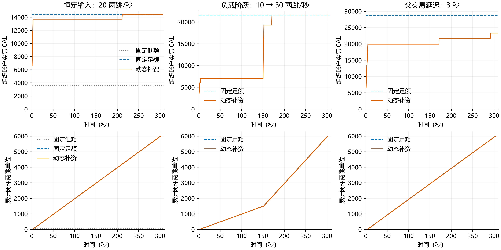

# E2 扩展：按签署水位补充 CAL 备付

实验日期：2026-09-23。基线为 `8e1fb40`，独立分支 `e2-adaptive-reserve`。**七组正式测试已完成，三个动态场景均完成全部计划付款，CAL 动态调节扩展验证通过。** 正式矩阵共公开结算 72,110 笔付款；另有 600 笔预跑用于检查链路和选定规划窗口，不计正式结果。

实现与正式数据提交：`5807546`。本报告串联[原 E2：组织代付](../finite-budget-2026-09-23/README.md)与[用户自付 FUEL 复测](../owner-fuel-2026-09-23/README.md)，补充 CAL 动态调节这一项；保留前两轮结果及尚未解决的工作权限边界。

[结果与图表](#结果) · [费用审计](#费用审计汇总) · [结论](#实验结论) · [复现与数据](#复现与数据)

## 实验要回答什么

原用户自付版 E2 表明：低 CAL 权限下，正常并行的不同付款可能各取得部分批准，却无法凑齐三票；即使委员会已无未结责任，成员签署权限仍可能占满。这一轮检验：从小额度启动，依据**成员真正可用的权限**补充有上限的资金，能否在保留正常并行签发的同时完成输入负载。

不清除旧锁、不取消原批准、不使用串行取证开关。FUEL 均由用户支付，Execution/Bytes 保持充足。该扩展只处理 CAL 容量，不把以前低工作权限的失败改写为成功。

## 实现与控制参数

委员会处理签名的公共 CAL 增量命令：从组织外的有限补资账户实际扣款，组织账户和原 Grant.Amount 同事务增加；Grant ID/Version 不变。四成员自行跟块，每人增加新旧 `floor(2G/3)` 的差额，旧 Reserved 不变。可用额度必须已在成员生效，HTTP202 不算补资完成。

每 200ms 采样，`H_low=rho×0.8s+b`、`H_target=1.25×H_low`。低于预警水位时，新增组织授权为 `1.5×(H_target−A_min)`，按100 CAL上取整并受资金上限约束。一笔在途，重复补投使用同一命令。`b=200+未成证唯一请求数×100 CAL` 是明确的保守余量，可能重复覆盖部分批准已占额度。

需求率使用实验预先声明的输入流，包含父、子两笔需求，重试不重复计数。不是已完成 TPS，也不是已实现的生产入口流量估计器。超过30秒未成证停止追加；补资十秒仍未在全员生效报错；无无限追加或自动清锁。

见[实现规范](../../implementation-adaptive-reserve-v4.md)、[正式运行前冻结的对照条件](preregister.md)、[GPT 实现评审](gpt-implementation-review.json)。系数正式轮内不调参。

## 运行条件

Mac Studio M4 Max，16核、64GB，同机九进程：4委员、4成员、1网关。委员会及组织采用已有实验内存状态；三个真实钱包采用原有本地事务和 TXCer 验证。每轮重新初始化，每成员一个 Worker，128个两跳在途槽。

每笔100 CAL，每组输入300秒，共6000个独立两跳单位，最多60秒收尾。子交易真实引用未确认的父输出及TXCer；统计委员会执行时实际登记的缺失输入责任，不把所有已签输出金额都当成实际公共责任。

常量组为20两跳/秒，固定低3600、固定足额14400、动态从3600且上限14400。阶跃组前150秒10、后150秒30两跳/秒，固定/动态上限21600。延迟组20两跳/秒、父公共提交延迟3秒，固定/动态上限28800。压力组更大的上限事先声明，不能与常量组混成等资金比较。

## 结果

每个完整两跳单位包含两笔付款，成功组各为 **6,000 个单位、12,000 笔付款**。下表余额均指组织账户，平均值按300秒输入窗口采样积分估算。

| 场景 | 策略 | 初始 → 最终 CAL | 平均组织 CAL | 完整两跳 / 计划 | 未成证部分批准 | 快速到账 P95 |
|---|---|---:|---:|---:|---:|---:|
| 恒定20单位/秒 | 固定低额 | 3,600 → 3,600 | 3,600 | 46 / 6,000 | 64 | — |
| 恒定20单位/秒 | 固定足额 | 14,400 → 14,400 | 14,400 | 6,000 / 6,000 | 0 | 1.565 ms |
| 恒定20单位/秒 | 动态补资 | 3,600 → 14,400 | 13,801.8 | 6,000 / 6,000 | 0 | 1.616 ms |
| 10 → 30单位/秒 | 固定足额 | 21,600 → 21,600 | 21,600 | 6,000 / 6,000 | 0 | 1.588 ms |
| 10 → 30单位/秒 | 动态补资 | 3,600 → 21,600 | 14,078.7 | 6,000 / 6,000 | 0 | 1.609 ms |
| 父提交延迟3秒 | 固定足额 | 28,800 → 28,800 | 28,800 | 6,000 / 6,000 | 0 | 1.551 ms |
| 父提交延迟3秒 | 动态补资 | 3,600 → 23,300 | 20,611.2 | 6,000 / 6,000 | 0 | 1.714 ms |



[矢量图 PDF](adaptive-reserve.pdf) · [汇总 CSV](summary.csv) · [完整分析 JSON](analysis.json)

**主结果是维持接纳与闭环，而非寻找最小资金。** 恒定低额组只启动174个单位，5,826个因在途窗口已满而未启动；最终46个完整闭环。动态恒定组保持同样的并行取证路径，全部6,000个单位完成。阶跃动态组前半段备付稳定在7,000，输入增长后逐次增加到21,600；延迟动态组不改变输入率，因占用变长而追加到23,300。

三个动态组实际登记的缺失输入义务分别为 **5,998 / 6,000 / 6,000**，全部随父交易正常成立而解除，无实际赔付。少数子交易到委员会时父输出已经存在，不登记义务，不能把这些付款也算作实际未确认输入担保。

| 动态场景 | 实际追加 CAL | 专用源初始 → 剩余 CAL | 成员 CAL 不足调用 | 控制器采样最长未成证年龄 |
|---|---:|---:|---:|---:|
| 恒定 | 10,800 | 10,800 → 0 | 0 | 353 ms |
| 阶跃 | 18,000 | 18,000 → 0 | 12 | 410 ms |
| 延迟3秒 | 19,700 | 25,200 → 5,500 | 0 | 469 ms |

源账户剩余量由初始额减实际转入计算，并结合公共资金转移规则及全账本守恒审计核对。12次是**成员调用次数**，包括四成员扇出及重试，不能当作12笔最终失败交易。阶跃中原请求重试后全部完成；本实验不支持“零瞬时拒绝”的说法。恒定动态组两次补资的决策至全员生效时间略超800ms，完整原始时刻保留在各组 `reports/reserve-control.jsonl.gz` 中，其他两动态组未超过该规划值。

三个动态组控制器无报错、无超龄停止，最终临时 CAL/Execution/Bytes 占用均为零。四委员状态哈希一致，资金与原始扣账审计通过。成功组每笔用户实际支出94 FUEL，12,000笔合计1,128,000；组织代付FUEL为零，预留余额正常退回。恒定、阶跃、延迟动态组分别执行5、7、9笔补资管理命令，暂不单独计费，其链上处理开销包含在实验运行内，但不混入付款数量。

快速时间沿用 E2 驱动口径：每跳开始发送至收款钱包验证并保存凭证；统计父、子两笔。这里仅为每秒40～60笔付款的资源周转测试，不替代最大TPS实验。低额组大量请求未完成，故不拿其少量成功请求的P95与完整组作正常性能比较。

### 补资与收尾耗时

| 动态场景 | 补资次数 | 决策至全员生效范围 | 完整实验耗时 |
|---|---:|---:|---:|
| 恒定 | 5 | 399.71～833.57 ms | 301.920 s |
| 阶跃 | 7 | 599.89～799.99 ms | 301.741 s |
| 延迟3秒 | 9 | 599.55～799.99 ms | 303.674 s |

完整实验耗时包含300秒输入期与收尾观察，不是单笔付款延迟。补资生效终点为控制器观察到四成员均应用新授权，包含采样间隔；并非仅委员会执行命令耗时。

### 费用审计汇总

以下三个动态组**每组各12,000笔正常付款**，金额单位均为 FUEL；原始字段见 [analysis.json](analysis.json) 及各组 `reports/budget-audit.json.gz`。

| 场景 | 用户累计最大预留 | 实际费用 | 节点报酬 | 销毁 | 退回用户 | 最终预留未释放 | 组织代付 |
|---|---:|---:|---:|---:|---:|---:|---:|
| 恒定 | 12,000,000 | 1,128,000 | 1,008,000 | 120,000 | 10,872,000 | 0 | 0 |
| 阶跃 | 12,000,000 | 1,128,000 | 1,008,000 | 120,000 | 10,872,000 | 0 | 0 |
| 延迟3秒 | 12,000,000 | 1,128,000 | 1,008,000 | 120,000 | 10,872,000 | 0 | 0 |

每行满足：`最大预留 = 实际费用 + 退回 + 最终未释放`，且 `实际费用 = 节点报酬 + 销毁`。累计预留是全程逐笔求和，不是某一时刻必须同时占用的余额。本轮没有实际赔付；赔付与重复投递的费用验证沿用[用户自付版 E2 报告](../owner-fuel-2026-09-23/README.md)，不将它们描述为本轮新增测量。

### 代码验证

- 正式包测试、相关 `-race` 测试及 `go vet` 均在 Mac 通过，见 [测试日志](project-tests.log)、[race 日志](race.log)、[vet 日志](vet.log)。
- 新增验证覆盖资金不足、签名错误、旧总额冲突、重复补资/跟块、累计份额舍入、原占用保留，以及补资后原字节请求可继续批准。
- 监测读取本地已生效 Grant，而非启动配置；离线成员审计同样使用实际授权总额并核对原始 debit。
- 所有组正常停机并导出审计状态；原始大文件压缩保留，未删除失败对照。

### 外部讨论复核

已向侧边栏 GPT 提供完整对照结果、资金来源、拒绝次数及测试限制。[结果评审记录](gpt-results-review.json)认可“E2 的 CAL 动态调节扩展在所测三个场景中验证通过”，同时明确：不能据此证明最小资本配置、任意预算下的活性或其他资源瓶颈已经解决。

## 如何解释资金效率

组织实际备付的时间积分按采样估算；另外报告专用补资账户初始和剩余资金、累计转入。动态组3600组织备付加10800专用源资金，仍配置了14400 CAL总资本。源资金在本实验中不能作其他用途，不能将其按零成本处理。

因此组织账户平均余额降低只能称为**延后划入及授权**，不能等同整个系统资本节省。以前7200固定CAL已通过同类恒定输入；本保守控制器不证明找到最小备付，也不证明比合理选择的固定额度更省资金。充分固定组不是经过优化的最小固定预算。

这轮不测最高TPS，不证明多网关、恶意部分批准、无限期运行或未知流量下无条件不阻塞。补资时延超过800ms、预算拒绝及未启动数量都保留；800ms只是规划值。每种正式配置目前一轮，尚不报告跨轮置信区间。

## 实验结论

在本轮有限补资源、已知输入需求和健康节点条件下，水位控制器可以自动扩大 CAL 签署权限，让三个场景均完成全部业务，并保持正常并行签发。固定低额对照的持续停滞没有在动态组重现，原占用最终正常解除。

该结果支持将机制作为**负载变化下的备付配置与准入缓解方法**。它不证明固定3,600 CAL就能承担全部流量，也不证明总资本更省、任何资源不足都能解决或无限期无阻塞。因此，结论是“E2 的 CAL 动态补资扩展验证通过”，而非所有有限预算问题已经消失。

## 复现与数据

```sh
python3 docs/experiments/adaptive-reserve-2026-09-23/reproduce.py --case low --prefix my-e2-
for c in high adaptive step-high step delay-high delay; do
  python3 docs/experiments/adaptive-reserve-2026-09-23/reproduce.py --skip-build --case "$c" --prefix my-e2-
done
python3 docs/experiments/adaptive-reserve-2026-09-23/analyze.py --prefix my-e2-
```

脚本拒绝覆盖已有实验目录。依赖相邻已提交的 E2/E1 公共实验辅助脚本。图表另加 `--plot`，需 Matplotlib。原始报告、采样和费用审计已压缩归档；`manifest.json` 记录119个证据文件解压后的原始字节 SHA-256，不包含私钥、节点数据库或二进制。
