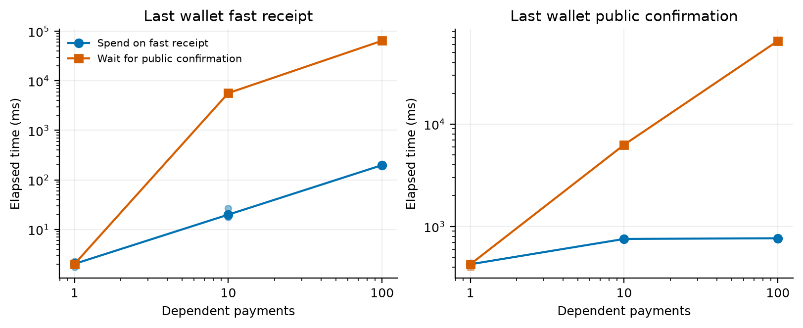
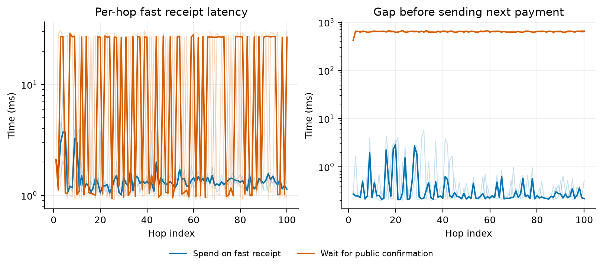

# 单组织真实连续续花：实验结果（2026-09-22）

在 Mac Studio M4 Max 上完成 18 个正式案例、666 笔付款，全部取得钱包快速到账、公共确认及成员收尾，并通过链级和全账本审计。本实验验证真实依赖链，不是再次测独立 UTXO 的系统 TPS。

## 方法与计时

三个独立钱包按 A→B→C→A 循环。每条链从 A 的一笔已最终 100 单位 CAL 开始，全额转给下一钱包；费用由组织 FUEL 账户分别授权代付。每跳均从当前钱包已接收状态选取上一跳输出，随后构造、签名、正常发送给组织，不能预生成整条链。

快速组收到并验证 TXCer、完成钱包本地事务后立即继续；等待组只在钱包验证公共区块、确认该输出后继续。两组使用同一签发、验签、消费检查、额度检查、INSTALL、公共结算和跟块代码。长度 1/10/100 各运行三次，第二次交换 A/B 顺序。每次从未运行过的同一创世模板复制全新状态，复用公私钥配置但不复用账本、钱包或交易结果。

环境：1 网关、4 成员（3 票）、4 委员，共 9 个本机进程。沿用实验内存存储及钱包 bbolt NoSync；成员 GOMAXPROCS=16、GOGC=200，commit=250ms、flush/gossip=10ms。没有改动生产支付或共识规则。正式轮关闭前台细粒度跟踪和运行时 profile，仅保留现有轻量提交事件用于判定父交易是否已提交。

每笔快速到账从付款钱包开始首次 HTTP 提交计时，到收款钱包验证与原子接收完成；包括发生时的原交易重试。链级计时从第一笔发送开始，包含中间构造、签名和等待：链末快速可用是最后钱包接收完成；链末公共可用是该钱包跟块确认；后台收尾是整条链所有成员状态均完成的最晚观察时刻。后两者包含查询/跟块观察延迟，不冒充原始共识提交延迟。客户端链级耗时使用单调时钟；跨进程先后用同一 Mac 的时间戳核对。

## 正式结果

下表为三次独立运行的中位值，单位毫秒。单跳 P50 列为三次运行各自 P50 的中位值；同一链内各跳不是独立实验重复。

| 链长 | 方式 | 链末快速可用 | 链末公共可用 | 整链后台收尾 | 单跳快速到账 P50 |
|---:|---|---:|---:|---:|---:|
| 1 | 立即续花 | 2.017 | 427.325 | 445.948 | 2.017 |
| 1 | 等待确认 | 2.004 | 427.094 | 446.038 | 2.004 |
| 10 | 立即续花 | 19.878 | 754.916 | 779.684 | 1.506 |
| 10 | 等待确认 | 5655.026 | 6280.535 | 6299.845 | 1.953 |
| 100 | 立即续花 | 198.630 | 766.765 | 785.519 | 1.298 |
| 100 | 等待确认 | 64383.577 | 65050.870 | 65070.670 | 26.783 |

长度 1 不包含续花。三次单笔值分别为：

- 快速组：1.749 ms、2.017 ms、2.274 ms。
- 等待组：2.004 ms、1.981 ms、2.196 ms。



## 确实花了未上链输出

快速组共 324 次后继付款，其中 324 次携带上一跳 TXCer；按后继首次发送时间与四委员最早应用提交事件比较，324/324 次在父交易尚未提交时就已发送，未知事件数为零。等待组未使用未确认输入。自然实验已有足够未上链样本，因此没有额外注入父交易延迟。

快速组账本共记录 96 项执行时来源输出缺失的责任，后续均由正常父交易到达而履行，无赔付。各案例按已提交块边界重建的未结项峰值最大为 1；这是块末可见数量，不是事务执行中间态的实时峰值。

## 链长、证据大小与重试

正式轮新 TXCer 大小始终为 941 字节；普通最终输入请求为 1891 字节，携带一个当前输入 TXCer 的请求为 2840 字节。未携带整条祖先历史，因此固定单输入/单输出结构下，单笔材料不随链长增长。总历史和总工作量仍随交易数增长。

100 跳快速组前、中、后段的逐跳延迟中位值如下；不是对无限链长或所有网络的性能保证。

| 重复 | 第 1–33 跳 | 第 34–66 跳 | 第 67–100 跳 |
|---:|---:|---:|---:|
| 1 | 1.261 ms | 1.320 ms | 1.292 ms |
| 2 | 1.285 ms | 1.330 ms | 1.285 ms |
| 3 | 1.268 ms | 1.298 ms | 1.308 ms |



快速组总 HTTP 提交次数为 333（333 笔付款），等待组为 495（333 笔付款）。钱包可能先于成员跟到新区块，此时普通输入会暂时遭遇 DEFERRED/QUORUM_UNAVAILABLE。两组统一使用相同已签名请求、25ms 间隔、10s 上限的有限重试；重试计入原笔延迟，授权错误不重试。等待组因此也包含真实的成员跟块滞后，不能把全部差异解释为单纯共识时间。

## 诊断、正确性与复现

独立 10 跳诊断轮的各阶段统计见 [diagnostic-stages.csv](diagnostic-stages.csv)。成员阶段并行执行，不能把成员耗时再与网关等票时间相加；诊断轮不混入正式性能统计。

所有正式案例均通过：四委员完整业务状态一致、待投递任务为零、全部付款费用关闭、CAL 缺口为零、无历史改写赔付；全账本 CAL/FUEL 守恒和成员原始占用/核销审计通过。逐跳确认输入消费事实、输出正文和最终性、上一钱包接收后才构造下一跳；最终只有链末输出未消费。实际费用每笔 94 单位 FUEL（84 奖励、10 销毁），本金沿链转手不增加。

开发试跑中保留了三类未纳入正式统计的记录：健康接口文本解析失败（未发交易）；导出工具误把字节数组当字符串；没有批量观察时，100 跳已全部快速接收但状态查询触发 429，导致收尾测量中断。正式版复用项目现有进度批量器，18 轮进度查询错误均为零。这些修正均属于实验驱动，不是共识或支付规则变更。

实现：`cmd/payctl/direct_chain.go`，入口 `payctl chain-v4`。构建与环境指纹见 [build.json](build.json)，新增测试及竞态检查、go vet 记录见 [tests.log](tests.log)。

```sh
python3 docs/experiments/continuous-respending-2026-09-22/reproduce.py --suite diagnostic --prefix new-
python3 docs/experiments/continuous-respending-2026-09-22/reproduce.py --suite formal --prefix new- --skip-build
python3 docs/experiments/continuous-respending-2026-09-22/analyze.py --prefix new-
```

同名前缀已有结果时脚本拒绝覆盖，需使用新前缀。重跑需空闲实验端口 26000–26301。所有私钥、运行数据库及未裁剪日志留在本地实验目录；仓库只保存公开配置、测试源代码和结果证据。

逐轮汇总见 [cases.csv](cases.csv)，逐跳记录见 [hops.csv](hops.csv)；正式统计只使用 `v3-` 且非 diagnostic 的 18 个案例。各案例的 `reports/` 含原始钱包事件、全局审计和链级审计，`settlements.json` 含四委员提交事件。图中展示所有三次重复，线取中位值。

结论范围：当前单机、单组织、固定三钱包、单条最长 100 跳支付链，在实验内存/NoSync 模式下能够在未上链输出上真实连续续花并完成账务收尾。没有测试跨机器网络、掉电恢复、任意长链或多链并发容量；不能用本实验的单链跳数/秒替代系统 TPS。
