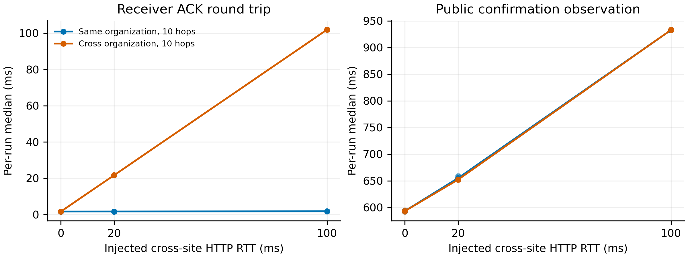
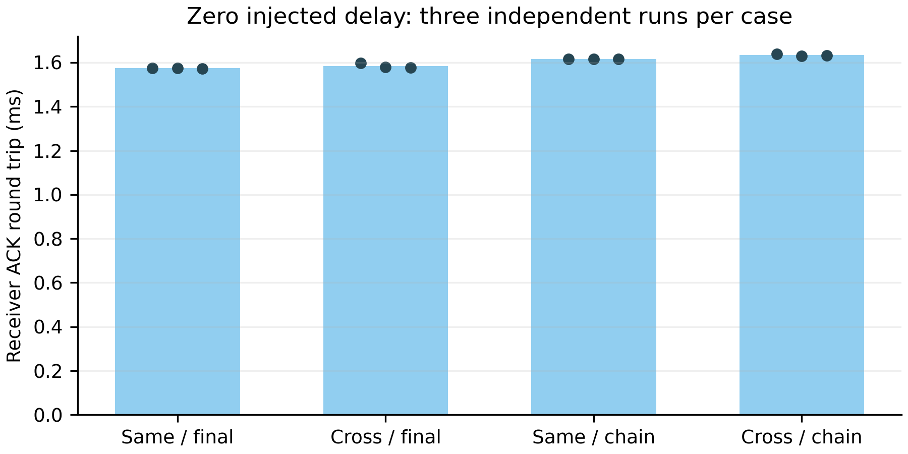
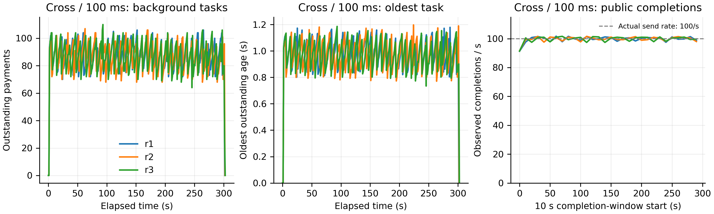

# E7 · 跨组织付款与网络延迟

**24 轮正式实验、342,000 笔付款全部完成并通过审计；另完成 10 次首次付款对照。**

本实验检验双组织互操作、真实连续续花，以及完整支付路径对 HTTP 延迟的敏感性。它不是最大 TPS 测试，也不是多机 WAN 共识测试。

[逐轮完整表](TABLES.md) · [实施与计时口径](METHOD.md) · [原始汇总](summary-all.json) · [评审记录](REVIEW.md) · [实验计划](../../research/e7-cross-org-network-plan-2026-09-24.md)

## 实验条件

Mac Studio M4 Max，16 核、64 GiB，macOS 26.6.2，Go 1.27.1。两个组织各有一个网关、四成员，共享四委员，所有组始终运行同样的 14 个服务。两个独立钱包进程各持有 32 个钱包身份，共 64 条活动 lane。

统一输入 **100 TPS，两组织各 50 TPS**；每笔 100 CAL，用户自付已最终 FUEL，资金与权限充足。组织及委员会使用显式内存实验模式，钱包 NoSync；签名检查、原子状态更新和共识规则保留。每轮重新创世、重启进程，先独立预热 500 笔并排空。

同/跨组织 × 独立最终输入/真实十跳四组做零注入对照；两种十跳负载另做 20、100 ms 站点间 HTTP RTT。每条件三次独立重复，普通轮 120 秒，跨组织十跳 100 ms 轮 300 秒。正式计划与实际首发均为 **342,000 笔**，两组织各 171,000 笔；预热 12,000 笔不混入正式性能统计。

逻辑站点 A/B 分别放组织及其钱包，C 放四委员。跨站 HTTP 请求和响应各增加 RTT/2。同站 INSTALL、组织内部认证及委员会 P2P 不加延迟；0 ms 组仍走同一个代理。

## 快速确认与公共观察

主指标是**付款钱包首次实际发送 → 收款钱包验证并原子接收 → ACK 返回付款钱包**，使用发送进程的单调时钟。它包含回程，不是单向到账时间。接收成功即可触发下一跳本地就绪队列，无需等 ACK 回到前一付款人。

下表统一取每轮前 120 秒首次发送的付款，数值单位 ms。“平均 P50”是三个独立运行中位数的算术平均，P95 列为三轮范围；不把全部付款当作独立重复。

| 场景 | 注入 RTT | ACK 平均 P50 | ACK P95 范围 | 公共观察平均 P50 |
| --- | ---: | ---: | ---: | ---: |
| 同组织 · 独立最终输入 | 0 | 1.574 | 1.935–1.960 | 592.070 |
| 跨组织 · 独立最终输入 | 0 | 1.584 | 1.938–1.990 | 592.462 |
| 同组织 · 十跳 | 0 | 1.615 | 2.073–2.105 | 593.217 |
| 跨组织 · 十跳 | 0 | 1.633 | 2.069–2.109 | 593.182 |
| 同组织 · 十跳 | 20 | 1.634 | 2.045–2.096 | 655.083 |
| 跨组织 · 十跳 | 20 | 21.664 | 22.061–22.113 | 652.196 |
| 同组织 · 十跳 | 100 | 1.742 | 2.130–2.151 | 932.874 |
| 跨组织 · 十跳 | 100 | 101.948 | 103.571–103.743 | 933.081 |



零注入时，同/跨组织快速 ACK 处于相近量级，不能据此断言跨组织成本为零。跨组织组在 20/100 ms 注入下分别约为 21.66/101.95 ms，与当前拓扑额外经过一次跨站收款交付往返相符；这不是所有部署下的协议延迟上界。

同组织快速路径留在本站，ACK 基本不变，但公共观察仍由约 593 ms 增至约 933 ms。公共观察包含公共投递、出块、跟块和查询，不能把差值全部解释为共识计算时间。

**尾延迟仍保留：** 部分十跳轮 P99 出现约 27 ms，20 ms 跨组织两轮 P99 约 47.6–47.7 ms；不能只凭 P50 宣称没有尖峰。所有逐轮 P50/P95/P99 及阶段时间见 [完整表](TABLES.md)。各阶段分别取分位数，不能直接相加。



## 五分钟内是否持续积压

三个跨组织 100 ms 运行各完成 **30,000/30,000 笔**，每个十秒发送窗口实际均为 100 TPS。全部正式轮的过期机会、无就绪输入、快速名额满、后台名额满和进度查询错误计数均为零。

| 五分钟运行 | 待办采样峰值 | 最老待办峰值 | 前段平均待办¹ | 尾段平均待办¹ | 稳态十秒公共完成观察速率² |
| --- | ---: | ---: | ---: | ---: | ---: |
| r1 | 106 | 1.179 s | 87.64 | 87.47 | 97.5–101.7 笔/s |
| r2 | 107 | 1.197 s | 86.88 | 84.68 | 97.6–101.6 笔/s |
| r3 | 110 | 1.186 s | 87.16 | 86.27 | 97.4–101.6 笔/s |

¹ 前段为采样起点后 10–60 秒，尾段为 240–300 秒；待办还包含成员完成观察。全局上限为 2,048，但未触及。约一秒采样的峰值不是精确瞬时最大值。

² 去掉初始 0–10 秒建立流水线的窗口，统计 10–300 秒内每个十秒窗口；这是钱包观察公共完成的速率，不是委员会内部出块 TPS。



待办随出块波动，没有随时间抬升，最后排空。它支持**所测配置在 300 秒窗口内持续承接实际 100 TPS**，不外推为无限持续或最大容量。

## 真实续花与责任审计

- 正式轮共 **169,677 个输入在构造时携带 TXCer**，完成 **26,112 条完整十跳链**。截止时已发送的合法短前缀也全部收尾，不强行补发剩余跳数。
- 100 ms 跨组织组每轮 26,992/30,000 个输入携带 TXCer，约 89.97%；这是钱包构造时尚未最终的输入，不能称为委员会执行时同样缺失来源。
- 正式矩阵只观察到 **1 项实际缺失来源责任**，位于 `formal-r2-d-20`，后续正常履行并通过审计。不能由单项案例估计发生概率或宣称网络延迟显著增加赔付。
- 四委员状态一致，outbox 排空；输入唯一消费、真实链边、链尾输出、费用及退款、用户自付、实际发行组织与签署成员原占用均通过检查。只有实际占用成员恢复其原额度，不把两个组织的成员权限相加当成资本。
- 正式及预热付款共 **354,000 笔**均接受审计；首次付款补充另审计 80 笔。各轮 `reports/e7-audit.json`、`reports/audit.json` 和 `passed.json` 保留。

五分钟跨组织组十跳整链 P50 约 **5.812 秒**，包含 64 lane、100 TPS 下的就绪等待，**不是协议最短十跳延迟**。最短连续续花应参考 E1，不能将这两个负载模型混用。

## 首次付款与资源成本

十次新进程控制、每次两侧各四笔，共 80 笔全部完成。20 个首次付款 ACK P50 为 **2.908 ms**，60 个后续付款 P50 为 **1.818 ms**。这只是该小样本的描述统计；创世已预配信任并可能预热缓存，新连接与运行时启动共同变化，不能归因为纯密码缓存收益，也不是动态组织发现测试。

服务 CPU 约为每笔 20.28–22.82 ms（14 个节点合计、各条件三轮均值），同 RTT 的同/跨组织数值接近。钱包与代理 CPU、RSS、HTTP 载荷和 endpoint 分类计数分别保留在 [逐轮表](TABLES.md) 与 [资源原始汇总](resource-summary.json)。HTTP 统计不包含委员会 P2P 和 TCP 头，且末尾校准期间仍有后台查询；不是每笔固有协议字节数。历史状态增长与活动积压分开解释。

## 失败预检与适用边界

最初 200 TPS、100 ms 预检实发 5,306/6,000，出现后台积压和赔付；付款观察完成，但内存 BlockStore 退出后不足以支持历史修订的离线审计，因此**该轮不通过**。保留全部失败材料，随后统一改为 100 TPS，不按组改变并发。详细原因见 [METHOD.md](METHOD.md)。

本实验支持双组织互操作、因果续花和指定 HTTP 延迟下的稳定工作点。它不证明多组织线性扩容、WAN 共识、丢包/带宽受限行为、生产耐久性或无限期运行。可选 Linux 跨机补充未连通，没有写入实测结果。两侧钱包和所有节点仍共用一台物理机器。

## 实现、复现与证据

新增 E7 双进程钱包、收款入口、站点延迟代理、独立限速和双组织审计，未修改生产支付协议。正式二进制对应源码提交 `13be856`，源码清单、二进制 SHA-256、环境及硬件信息保存在本目录；Mac 原检出标识与校验源码身份的区别见 METHOD.md。

普通 Go 测试、`comet_v3` 测试、Mac 竞态测试及 `go vet` 通过；[实现提交的 GitHub 验证](https://github.com/19231224lhr/Next/actions/runs/35992036761)通过。[Mac 测试记录](verification.log)随证据归档。

在配置好项目 Comet 源码覆盖及 Go 环境的 Mac 上，先使用 `reproduce.py` 构建并跑新标签的短预检；审查工作点后执行固定矩阵。已有结果目录不覆盖，需在干净实验检出复现。`suite.py` 会跳过已有通过轮次，不能把它误当重跑全部实验。

```sh
python3 docs/experiments/cross-org-network-2026-09-24/reproduce.py --label check-d100 --mode D --rate 100 --duration 30 --rtt 100
python3 docs/experiments/cross-org-network-2026-09-24/suite.py
python3 docs/experiments/cross-org-network-2026-09-24/cold.py
python3 docs/experiments/cross-org-network-2026-09-24/tables.py
python3 docs/experiments/cross-org-network-2026-09-24/figures/gen_fig_e7.py
```

`formal-*` 是 24 轮正式数据，`cold-*` 是十次首次付款控制，`preflight-*` 是单列预检；`.json.gz` 为压缩原始 JSON。`summary-all.json` 可由逐笔记录重新计算。图表同时提供可编辑生成脚本以及 PDF/PNG，三重复作为独立运行展示。
