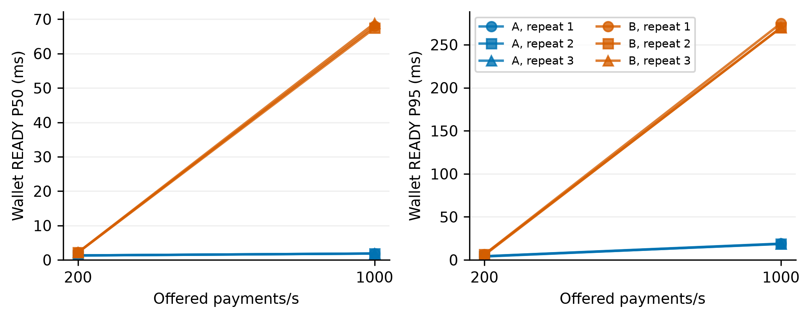
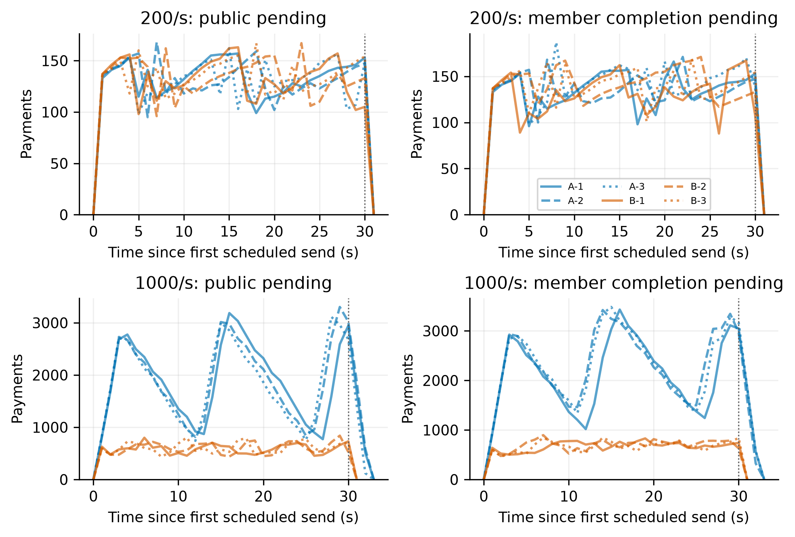
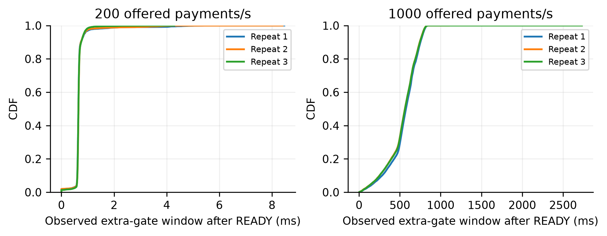
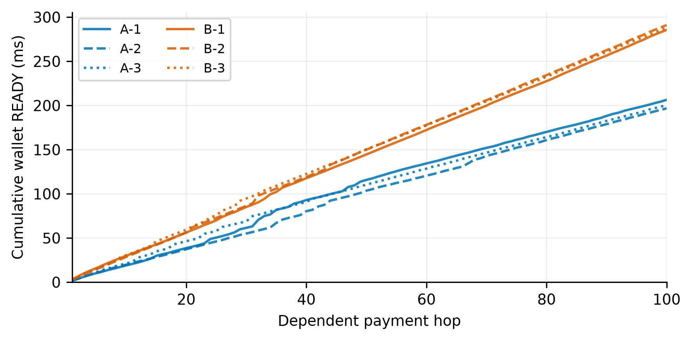

# E5：快速交付门槛消融

> 已完成：6 轮校准、12 轮独立负载和6条100跳链。独立负载计划216,000笔，实际发送186,219笔，全部完成并通过审计；29,781笔未发全部发生在1000 TPS的B组。连续续花600笔全部完成。未发没有被算成成功付款。

**结果支持当前“成证后先交付、后台继续推进”的设计。** 同实际200 TPS下，A的钱包到账中位数约1.30 ms，B约2.16 ms；100跳整链钱包可用时间的三轮中位数由287.98 ms降至200.36 ms，缩短约30.4%。1000 TPS档中，A按计划发送，B因固定64个发送名额被等待占住而少发；该档不能解释成相同实际负载下的纯复制成本。

[逐轮汇总 CSV](matrix.csv) · [完整统计 JSON](summary.json) · [每秒待办曲线](curves.csv) · [原始证据校验清单](evidence/manifest.json)

## 独立付款结果

每行是一轮独立实验；到账从首次实际发送到钱包验证并完成本地事务。所有“实际发送”的付款均达到READY、公共观察和四成员收尾。

| 计划 TPS | 组别/重复 | 实际发送/计划 | READY P50（ms） | READY P95（ms） |
| ---: | --- | ---: | ---: | ---: |
| 200 | A-1 | 6,000/6,000 | 1.298 | 4.276 |
| 200 | B-1 | 6,000/6,000 | 2.167 | 6.416 |
| 200 | A-2 | 6,000/6,000 | 1.300 | 4.223 |
| 200 | B-2 | 6,000/6,000 | 2.160 | 6.177 |
| 200 | A-3 | 6,000/6,000 | 1.304 | 3.957 |
| 200 | B-3 | 6,000/6,000 | 2.168 | 5.613 |
| 1000 | A-1 | 30,000/30,000 | 1.862 | 18.943 |
| 1000 | B-1 | 19,940/30,000 | 67.998 | 274.827 |
| 1000 | A-2 | 30,000/30,000 | 1.870 | 18.569 |
| 1000 | B-2 | 20,171/30,000 | 67.395 | 269.733 |
| 1000 | A-3 | 30,000/30,000 | 1.865 | 18.746 |
| 1000 | B-3 | 20,108/30,000 | 68.816 | 269.864 |



200档两组都承接相同实际负载，A的到账P50比配对B低约40%。1000档B实际发送率为664.7、672.4、670.3笔/秒，计划发送滞后P95为9.32～9.54秒。其READY均值约94.9～95.9 ms，与`64 / 平均占槽时间`约667～675笔/秒相符，解释了固定客户端并发下的发送背压；这不是系统或INSTALL的最大容量。

1000档B在“已具备A交付条件”之后仍需等待门槛，条件等待P50为65.0～66.4 ms；条件满足到实际释放的P95仅0.017 ms，未发现代理长期持锁或漏唤醒造成上述等待。B没有为了达到全部计划数量而增加并发或延长发送窗口。

## 后台工作量与观察窗口

| 工作点 | 每轮实际 Submit 次数 | 每轮 INSTALL 次数 | 最后发送到四成员完成观察 |
| --- | --- | --- | --- |
| 200，A/B | 均为6,000 | 均为24,000 | 0.56～0.81秒 |
| 1000，A | 30,002 / 30,002 / 30,002 | 60,734 / 64,350 / 64,176 | 2.43 / 2.29 / 2.47秒 |
| 1000，B | 19,940 / 20,172 / 20,110 | 79,642 / 80,578 / 80,375 | 0.70 / 0.68 / 0.74秒 |

200档钱包公共确认观察P50为661～672 ms，两组接近。1000档A的钱包公共观察P50为2.02～2.06秒，B为0.88～0.90秒；两组实际输入不同，而且这是钱包跟块后的观察值，不是委员会精确Commit耗时，也不能据此说B共识更快。

1000档A有60.7%～64.7%的额外门槛先由公共成功满足，原后台规则会取消不再需要的INSTALL，因此每笔实际INSTALL约2.02～2.15次；B约3.99次。两组后台算法相同，不代表实际工作量完全相同。少量重复Submit均通过幂等处理，未造成重复付款或费用。



1000档A的公共未完成采样峰值为3,114～3,303笔，四成员完成观察的待办峰值为3,421～3,483笔；停止发送后全部排空。这说明前台低延迟不等于没有后台在途量。本轮只有30秒输入期，不证明无限持续无积压。

A相对额外门槛的观察窗口，在200档P50为0.645～0.650 ms、P95为0.849～0.870 ms；在1000档P50为562～575 ms、P95为776～784 ms。后者多数由公共事件结束，**不能把这个窗口称为“完全没有任何副本”的时间**。原始逐笔数据同时保留首个完整成员副本的观测时刻。B的READY后窗口均为零，符合其门槛定义。



## 真实连续续花

每条链为100次实际付款，三个钱包轮流接收并继续发送。每条链的99个后继输入全部使用钱包尚未观察到最终确认的TXCer，六条链共594/594；没有伪造独立输入来替代续花。这是钱包观察和实际输入类型的口径，不据此断言父交易在委员会尚未提交。

| 重复 | A：100跳钱包可用（ms） | B：100跳钱包可用（ms） |
| ---: | ---: | ---: |
| 1 | 206.421 | 285.573 |
| 2 | 196.712 | 291.004 |
| 3 | 200.356 | 287.983 |
| 三轮中位数 | **200.356** | **287.983** |



每条链均为100次Submit、400次INSTALL，所有付款最终结算、成员原始占用解除、最后输出归属核对通过。此处约30.4%的整链时间缩短包含真实的逐跳构造和钱包处理，不能用单笔延迟简单乘100替代测量。

## 费用与校准

正式独立付款累计预留186,219,000 FUEL，其中节点及服务报酬15,642,396、销毁1,862,190、退回168,714,414，最终仍冻结为零；实际费用合计17,504,586 FUEL，即每笔94。六条链共预留600,000 FUEL、实际消费56,400、退回543,600。以上为累计流量，不是同时占用量；费用全部由用户支付，组织代付为零。

三轮100笔校准中，直连READY P50为0.919～0.938 ms，代理A为1.266～1.285 ms。代理和额外观测存在可见开销，因此本文保留原始A/B数字，不从分位数中减去所谓“代理成本”。校准不作为正式收益样本。

## 实验问题

取得三份批准后立即交付 TXCer，和继续等待额外材料复制条件再交付，有什么区别？本实验只改变钱包响应的交付门槛，保留同一套网关、成员、公共提交和跟块流程。

| 组别 | 钱包响应交付条件 |
| --- | --- |
| A | 代理完整收到网关凭证并验证后立即交付 |
| B | 在 A 条件之外，等待三个不同成员实际保存完整材料，或观察到经过验证的公共成功；取较早者 |

成员已经观察到公共成功而跳过 INSTALL 时，返回 `already_observed`，不计作一份完整成员副本。公共事件沿用 `VerifyBlock`、下一高度结果认证和本地 Commit 后通知；不是凭高度或 HTTP 202 放行。

## 环境与控制

- Mac Studio M4 Max，16 核 CPU、64 GiB 内存，macOS 26.6.2，Go 1.27.1，单机 loopback。
- 一个担保组织：一个网关、四成员；四委员。两组使用同一个实验代理实现，B 的等待只发生在代理到钱包的响应一侧，不阻挡网关 Flush 后的后台启动。
- 成员、网关、委员会应用状态及 BlockStore 使用实验内存配置，钱包使用 NoSync；不提供断电耐久性结论。
- 每笔 100 CAL；用户用自己的最终 FUEL 输入支付，预留上限 1,000 FUEL。组织没有代付 FUEL 资金或相应授权，其他权限充分。
- 每轮从全新创世开始，100 笔独立预热并排空；正式输入与预热不重用。链条由三个钱包轮流发送，使用实际收到的上一跳输出，三方各自使用独立最终 FUEL。
- 固定 64 个发送 worker；独立付款以 200 或 1000 TPS 计划输入 30 秒。到窗口末尾不补发积欠任务，未发如实计数。2 秒 HTTP 期限、相同签名字节间隔 50 ms 重试、30 秒逻辑请求期限；已发付款继续观察最多 60 秒。
- 正式矩阵每档 A/B 三对，顺序 AB、BA、AB；第二次重复先跑 1000 档再跑 200 档。种子 23/37/59 仅控制输入排列，不代表随机网络采样。

校准为直连与代理 A 各三轮、每轮 100 笔；正式独立付款共计划 216,000 笔；连续续花共六条 100 跳链。各轮源码提交、二进制 SHA-256 与环境变量包含在证据中。

## 计时与统计

快速到账从付款钱包首次实际发送开始，到收款钱包验证输出和 TXCer 并完成本地事务。独立付款提前构造签名，另外报告计划发送滞后；链条总时间包含收到后再构造下一跳的真实工作。

代理分别记录：完整收到上游响应、完成共同校验而具备 A 交付条件、观测到额外门槛、实际释放响应。B 的条件等待为 `max(0, 门槛观测时刻 − 具备 A 交付条件时刻)`；门槛满足后的调度释放时间单独记录。HTTP 回执被代理观测到的时刻不是成员存储完成的精确时刻。

A 的额外门槛观察窗口为 `max(0, 门槛观测时刻 − 钱包 READY)`，同时记录首次完整成员副本。窗口不等同于完全没有副本、资金危险或断电丢失的时间。

公共与成员完成是经过跟块或批量状态查询后的观察时间；成员查询间隔为 100 ms，不能当作精确执行完成时刻。CPU/RSS 每秒采样作辅助解释。每轮分别给出分位数；不把多个分位数平均成总体分位数，也不以逐笔付款数代替独立重复数。

## 预跑中发现并修正的驱动问题

预跑 1000 TPS 的 B 组在 30 秒内实际发送 20,232 笔，全部到账、上链并完成成员收尾；9,768 笔因发送名额占用而未发。原驱动仍把未发样本放入排空条件，错误地额外等待 60 秒并终止矩阵。

修正仅涉及实验驱动：未发单列，排空只等待已发任务；逐笔审计只允许排除明确未发、无 QC 且无任何完成记录的样本。已发失败或状态未知不能被过滤，全账本审计及公共付款总数核对仍保留。64 worker、A/B 门槛和后台业务均未改变。正式矩阵使用修订驱动完整重跑，预跑不纳入正式收益统计。

预跑 B 的门槛满足到实际释放 P50 为 0.009 ms、P95 为 0.017 ms、最大 0.474 ms，明显小于此前等待；代理等待不持锁，INSTALL 与公共观察独立推进。这排除了“条件已满足但代理长期不释放”作为该轮主要原因。

## 验证与证据

逐笔检查输入消费、用户费用预留/支出/退款、签署成员原始扣账及解除；全账本检查四委员状态一致、公共付款数等于实际发送加预热、待处理记录排空。未发数量始终保留，不把“所有已发完成”写成“所有计划发送完成”。

复现：

```bash
python3 docs/experiments/delivery-gate-2026-09-24/reproduce.py --suite calibration --prefix reproduction-
python3 docs/experiments/delivery-gate-2026-09-24/reproduce.py --suite formal --prefix reproduction- --skip-build
python3 docs/experiments/delivery-gate-2026-09-24/reproduce.py --suite chain --prefix reproduction- --skip-build
python3 docs/experiments/delivery-gate-2026-09-24/analyze.py --prefix reproduction-
python3 docs/experiments/delivery-gate-2026-09-24/plot.py
```

复现脚本默认使用 Mac 上的 Go 路径及 loopback 端口 26000—26301、29000。分析脚本的默认输入是本报告的 `v3-*` 目录，可通过 `--prefix` 指定复现前缀；绘图需要 matplotlib。每轮生成新的密钥和交易身份，复现的是相同经济参数与发送计划，不要求签名字节相同。

## 能支持与不能支持的结论

本实验比较当前后台实现中的两个交付条件。相同实际负载时可比较延迟；若 B 因固定客户端并发而少发，应解释为交付等待带来的发送背压，不能将其实际发送率称为 INSTALL 或系统吞吐上限。

不能据此推出完整旧版两阶段协议的成本、等待式网关 handler 的真实容量、广域网性能、持久复制保证或相对外部系统优势。代理校准开销不能从正式分位数中直接相减。后台先公共成功而取消剩余 INSTALL 是原有规则，因此两组实际 INSTALL 工作量也不必完全相同。

[预先制定的方案](../../research/e5-delivery-gate-ablation-design-2026-09-24.md) · [与 GPT 的评审记录](../../research/e5-delivery-gate-review-2026-09-24.md)

完整原始证据位于 [evidence](evidence/)，每份归档的大小和 SHA-256 记录在 manifest.json；归档不包含运行数据库或私钥。正式样本使用 v3 前缀，pilot 归档仅用于记录驱动问题。

最终验证：Mac 上的 go test -tags=comet_v3 ./...、go vet -tags=comet_v3 ./... 及 E5 race 测试均通过，日志随本报告保存。
