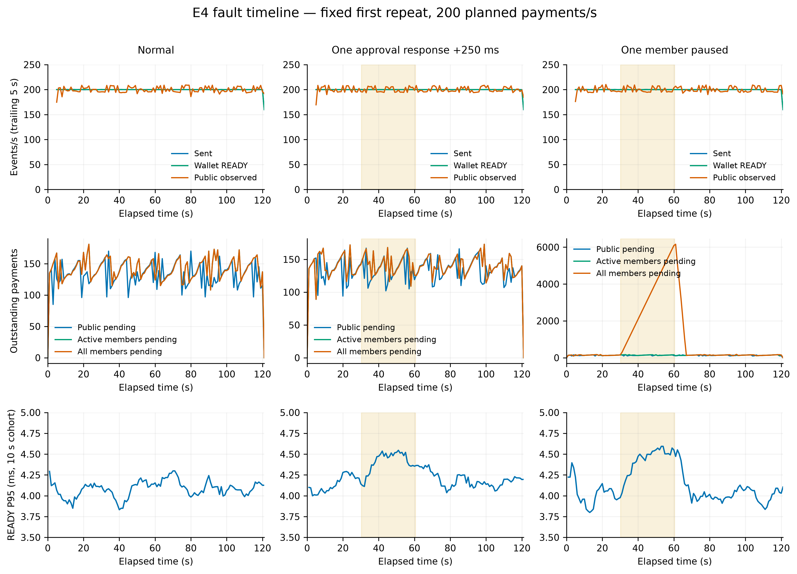
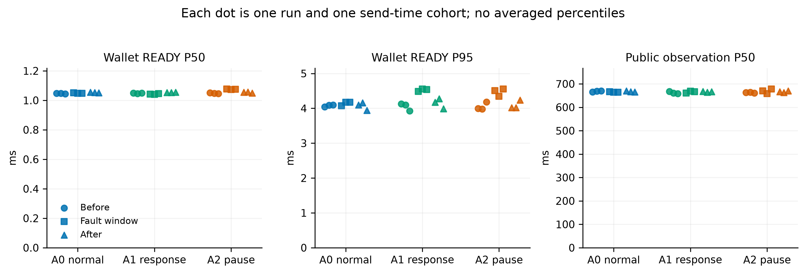

# E4：故障可用性与冲突安全

**实验完成，既定检查通过。** 正式九轮共 **216,000 笔付款**全部快速到账、公共成立并完成四成员收尾；另完成十五轮故障边界控制和六类、每类二十组冲突测试。一个成员批准响应变慢或暂停时，所测系统仍承接约 **200 TPS**，全程快速到账中位数约 **1.05 ms**。

同时保留两个真实限制：**完整材料尚未扩散时，网关暂停会阻断自主结算；并发冲突可能留下未决局部批准。** 实验通过不等于这两个边界消失。

[实验方案](../../research/e4-fault-conflict-experiment-design-2026-09-23.md) · [九轮明细](matrix.csv) · [分阶段明细](phase-matrix.csv) · [完整统计](summary.json) · [证据清单](evidence/manifest.json) · [实施复核](../../research/e4-implementation-review-2026-09-24.json) · [最终结果复核](../../research/e4-result-review-2026-09-24.md)

## 实验目标

本实验回答三个问题：一个成员变慢或暂停，其他三人能否继续提供快速付款；网关在不同交付阶段暂停，现有副本能否继续结算；冲突、篡改与重复请求会不会造成重复支付、收费或释放额度。它检验指定故障下的能力与边界，不测最高 TPS。

## 正式九轮结果

每轮 24,000/24,000 笔完成，发送尝试恰好 24,000 次，付款驱动没有 HTTP 重试、最终业务失败、预算不足或强制杀进程。四委员终态哈希一致，逐笔输入、费用及成员原始权限核对通过。这里的零失败指付款最终结果；代理仍记录取满三票后取消剩余请求、暂停时查询超时，以及尚未形成目标高度时的查询失败，不把它们抹成零网络错误。下列为各轮分位数，不是平均分位数。

| 场景 | 重复 | 完整驱动用时 s | READY P50 / P95 ms | 公共观察 P50 ms | 公共未完成峰值 | 四成员未完成峰值 |
| :--- | ---: | ---: | ---: | ---: | ---: | ---: |
| A0 正常 | 1 | 120.601 | 1.052 / 4.075 | 667.97 | 170 | 181 |
| A0 正常 | 2 | 120.698 | 1.051 / 4.146 | 666.68 | 172 | 180 |
| A0 正常 | 3 | 120.902 | 1.049 / 4.046 | 666.44 | 166 | 179 |
| A1 批准响应延迟 | 1 | 120.805 | 1.049 / 4.232 | 665.77 | 167 | 173 |
| A1 批准响应延迟 | 2 | 120.700 | 1.048 / 4.293 | 664.58 | 170 | 182 |
| A1 批准响应延迟 | 3 | 120.600 | 1.051 / 4.125 | 664.76 | 167 | 184 |
| A2 单成员暂停 | 1 | 120.701 | 1.059 / 4.142 | 666.38 | 170 | 6,160 |
| A2 单成员暂停 | 2 | 120.779 | 1.058 / 4.075 | 662.35 | 172 | 6,161 |
| A2 单成员暂停 | 3 | 120.602 | 1.053 / 4.280 | 669.17 | 171 | 6,273 |

完整驱动用时从发送阶段开始，含最后公共观察和成员收尾，不含预先构造请求、初始化节点或停机后的离线审计。九轮单笔 READY 最大值为 18.02 ms；计划发送到实际发送的 P95 为 0.36～0.59 ms，没有用显著降低发送率掩盖故障。

**中位数接近，尾部有小幅增加。** 按实际故障窗口内发送的付款统计，A1 READY P95 为 4.482～4.557 ms，A2 为 4.343～4.557 ms；不能写成故障完全没有性能影响。A1/A2 故障窗口内的所有 QC 均不含目标成员的票，确认由另外三人完成签发。实际窗口发送率约 199.993～200.029 TPS。

A2 实际暂停窗口约 30.146～30.193 秒。包含暂停副本的未完成峰值超过六千，但公共未完成峰值只有 170～172，活跃三成员未完成峰值为 170/171/173。恢复后 **5.701 / 5.705 / 5.479 秒**，观察到SIGCONT 恢复时刻前已发送的全部事实（包括暂停期间发送的付款）全部在该成员补齐；该数值包含批量观察等待，不能当成节点纯追赶耗时。



[时间线 PDF](figures/fault-timeline.pdf)。固定展示各场景第一轮；阴影为真实注入窗口。第二行区分公共、活跃成员及全部成员的待完成数量；A2 活跃成员特指未暂停的三人。底行使用相同的 3.5～5.0 ms 纵轴展示尾部变化。曲线每秒采样，吞吐按最近五秒计；末尾输入停止后的下降不表示服务故障。



[阶段图 PDF](figures/phase-comparison.pdf)。每个点是一轮、一个实际发送时间段的统计；图中无置信区间或显著性结论。

## 十五轮故障边界控制

每个场景一笔交易、独立重复三次，全部完成预期检查。

| 场景 | 停顿期间结果 | 恢复或接管结果 |
| :--- | :--- | :--- |
| B1：READY，但未 INSTALL/公共投递 | READY 约 2.01～2.15 ms；网关停顿十秒内没有自主公共完成 | 恢复后完成；从首次发送到公共观察约 10.527～10.540 s |
| B2：READY，只有成员 0 完成 INSTALL | 网关仍暂停时即公共成功 | 首次 INSTALL 成功到公共观察 2.503～2.508 s，包含备用期限、结算及查询 |
| B3a：批准请求尚未转发 | 没有 READY 或公共完成 | 恢复同请求后完成 |
| B3b：只有两份实际批准 | 没有三票凭证，局部占用保留 | 恢复同请求后完成 |
| D：两个成员暂停三秒 | 不足三票，没有 READY | 恢复同请求后完成 |

B2 的后台完成不依赖等待网关恢复；驱动约 2.61 秒就观察完全部事实，控制器仍维持完整十秒网关暂停窗口。B1 的结果只说明此交付边界下现有路径未在十秒内接管，不意味着凭证无效或永远无法结算。

## 冲突、重复与篡改

最终网络运行是 `v6-conflicts`，六类各二十组，四委员终态一致、公共待办排空。

| 类别 | 结果 | 真实公共付款 |
| :--- | :--- | ---: |
| 同 CAL、不同 FUEL 并发冲突 | 14 组一份 QC，6 组零份；没有两份冲突有效 QC | 14 |
| 不同 CAL、同 FUEL 并发冲突 | 11 组一份 QC，9 组零份；没有重复费用消费 | 11 |
| 已有 QC 后再次冲突 | 二十组均只有原付款成立 | 20 |
| 同请求及公共提交重复 | 每组四次取证请求、三次额外公共提交；每组只收费一次 | 20 |
| 修改金额或收款人，沿用原 QC | 80 次同接口合法 INSTALL 对照成功；40 次钱包实际接收拒绝、160 次成员 HTTP `INVALID_AUTH` | 20 个合法对照 |
| 错误组织入口 | 二十组均无 QC、无公共付款 | 0 |

篡改报文先验证能按 wire 4 解析，修改后付款人的签名及初始资金承诺有效，保留原 QC Fact，再实际发到四成员接口。这样定位的是证书绑定不匹配，不是本地编码失败或网络超时。原始报文随证据保存。错误组织组发送原本合法的请求到不具备其消费权的另一组织入口，不是测试任意跨组织收款失败。

**并发冲突留下 79 条成员未决局部批准：** CAL 签署权限残余合计 7,900，Execution 2,054，Bytes 8,117,487；没有强行清锁。其中也包括胜方已上链、败方局部批准尚未解除的情况。这些是成员账本上的重叠权限合计，**不能把 7,900 当成组织真实备付本金或赔付损失**。本实验支持冲突安全，不证明恶意冲突持续发生时预算永远不会被占满。

## 费用与验证

所有费用均由用户自付。每个正式 A 轮次：

| 项目 | FUEL |
| :--- | ---: |
| 24,000 笔累计费用预留 | 24,000,000 |
| 实际费用 | 2,256,000 |
| 未使用预留退回 | 21,744,000 |
| 组织代付 | 0 |

C 共 85 笔真实公共付款，费用 **7,990 = 85 × 94 FUEL**。重复请求和重复投递未新增费用效果；未决局部批准的输入锁和权限不因 outbox 排空而假定已经释放。E4 未触发赔付，赔付费用见 E3。

Mac 上 `go test -tags=comet_v3 ./...` 通过，日志见 [tests-mac.log](tests-mac.log)；Windows 上同一标签的全项目测试、payctl 的 `go vet`、门控及篡改夹具的 race 测试通过。项目存在旧的无标签委员会测试与编译接口不匹配，本轮使用实际运行的 `comet_v3` 标签，不把无标签测试说成通过。

正式 A 的二进制与源码指纹见 [build-formal.json](build-formal.json)，原驱动源码见 [formal-driver-source.tar.gz](formal-driver-source.tar.gz)；最终 C 的指纹见 [build-conflicts.json](build-conflicts.json)。早期 B/D 使用同一负载与门控实现，未逐轮复制构建清单，保留配置、事件和原始日志。最后对 C 的增强只增加正向对照、攻击报文保存与局部批准审计，不修改被测业务。

调试记录不混入正式结果：`v1/v2-smoke` 是配置读取类型问题；`v3-conflicts` 被本地编码器拒绝而中止；`v4-conflicts` 的篡改拒绝停在客户端，`v5-conflicts` 是未保存全部攻击原始字节的前置网络轮。它们均保留在证据包，正式 C 只采用 `v6-conflicts`。另有 80 笔冒烟及三轮各 2,400 笔预跑，均与正式九轮分开。

## 固定条件

| 项目 | 条件 |
| :--- | :--- |
| 环境 | Mac Studio M4 Max，16 核、64 GB；同机多进程、回环网络 |
| 拓扑 | A/B/D：1 组织、4 成员、1 网关、4 委员；C 增加另一组织，共 14 个服务进程 |
| 协议 | re/fb95f5e，wire 4；只增加实验命令和工具，不修改业务协议 |
| 存储 | 委员会应用及 BlockStore、成员、网关均为实验内存模式；钱包 bbolt NoSync |
| 共识 | Commit 250 ms，Flush/Gossip 各 10 ms；保留验签和本地原子更新 |
| 资源 | 独立最终 CAL UTXO，每笔 100；用户独立最终 FUEL 输入 10,000；每笔费用预留上限 1,000；无组织代付 |
| 权限 | CAL、Execution、Bytes 固定充分授权；不自动补资、不串行取证 |
| 主负载 | 每秒计划发送 200 笔，120 秒共 24,000 笔；30 秒正常、30 秒注入、60 秒恢复，再最多 60 秒收尾 |
| 重复 | A0/A1/A2 各三轮，轮换顺序；每轮重新创世 |
| 驱动 | 64 个发送 worker；单请求 HTTP 超时 2 秒，50 ms 后原字节重试，总请求期限 30 秒 |
| 观察 | 钱包及四成员各有独立观察循环，批量最多 128 项；成员查询超时 500 ms；每轮查询后间隔 100 ms |

种子 23/37/59 用于选择目标成员编号 `seed % 4`，依次为 3/1/3；不是随机交易到达或全节点故障覆盖。A1 只给一个成员的**批准响应**增加 250 ms 等待，客户端取消可提前结束等待，INSTALL 和跟块保持正常。A2 用 SIGSTOP/SIGCONT 保留原进程状态，不能称为丢失状态后的崩溃恢复。

## 测量口径

- **快速到账 READY：** 付款驱动即将发出 HTTP 请求，到收款钱包验证 TXCer、核对输出绑定并完成本地事务。请求构造、编码和付款钱包请求保存提前完成，不计入本轮发送后延迟；不包含远程收款设备的额外网络。
- **公共完成观察：** 钱包跟随已验证公共块，再由观察循环发现对应输出已成立；包含跟块及采样等待，不等于精确 Commit。
- **成员完成观察：** 对具体 Fact 观察到成员已跟块；确实批准过的成员还须完成原始额度核销。暂停副本的查询超时记为未知，不能当成已完成。
- **有限任务清单：** 所有计划付款及四成员债务均保留在最多 30,000 项数组中，本轮使用 24,000 项。发送名额在 READY 后释放，不等待全部成员；没有以 2,048 个总未完成任务上限把故障期流量人为压低。这是有限实验，不证明无限积压的资源可控性。
- **图中的时间窗口：** 延迟按实际发送时刻划分正常、故障、恢复三个 cohort；另报窗口内实际发生的 READY/公共完成数量。分位数不相加，也不把三轮分位数平均当成总体分位数。
- **追赶时间：** 恢复后观察到 SIGCONT 恢复时刻前已发送的全部付款全部在该成员完成的上界，含批量扫描等待；不能当成节点真实执行追赶耗时。

## 网关边界与安全判据

所有 B 组在发送请求**之前**配置转发前门控，再确认阶段事实后暂停网关。代理直接拒绝被阻断请求，不缓存等待释放；成员自身公共投递不经过该门控。

| 场景 | 暂停前条件 | 窗口中的预期 |
| :--- | :--- | :--- |
| B1 | 钱包已接收；所有 INSTALL 和网关公共提交均未转发 | 记录是否自主完成；不由驱动代替补投 |
| B2 | 钱包已接收；仅成员 0 INSTALL 成功；网关公共提交未转发 | 成员原有有限延迟备用路径继续提交 |
| B3a | 所有批准请求均未转发 | 不应产生合法 READY |
| B3b | 仅两成员实际批准 | 不应产生三票凭证；保留局部占用 |
| D | 两个成员暂停 3 秒 | 不足三票不能 READY；恢复原请求后另计结果 |

B 组暂停 10 秒后恢复原进程。实验实现统一保留最多 60 秒排空观察，比方案初稿的 30 秒更宽；实际恢复时长单独报告，不掩盖等待。

C 每类 20 组：并发 CAL 冲突、独立 CAL 共用 FUEL、已有 QC 后再次冲突、重复请求与公共投递、篡改金额/收款人、错误组织入口。CAL 冲突候选使用不同费用输入；FUEL 冲突候选使用不同 CAL 输入。攻击请求实际进入网络，不用钱包本地防重代替成员检验。

并发冲突允许 0 或 1 份 QC，绝不允许两份冲突有效 QC；0 QC 时可能留下局部批准。所有实际成功付款只计费一次，未决批准按原记录列账，不清锁、不返还未解除责任的额度。

## 复现与证据

在 Mac 项目根目录运行，需 Go 与 Python 3，绘图另需 matplotlib（本报告使用 3.11.2）。脚本顺序使用固定端口，不可同时启动两个套件。

```sh
python3 docs/experiments/fault-conflict-2026-09-23/reproduce.py --suite smoke --prefix v9-
python3 docs/experiments/fault-conflict-2026-09-23/reproduce.py --suite controls --skip-build --prefix v9-
python3 docs/experiments/fault-conflict-2026-09-23/reproduce.py --suite pilot --skip-build --prefix v9-
python3 docs/experiments/fault-conflict-2026-09-23/reproduce.py --suite formal --skip-build --prefix v9-
python3 docs/experiments/fault-conflict-2026-09-23/analyze.py
python3 docs/experiments/fault-conflict-2026-09-23/figures/gen_fig_fault.py --prefix v9-
```

每次使用新的 prefix。`controls` 已包含 C；`conflicts` 可单独复测 C。脚本创建实验目录和节点，在退出时恢复暂停进程、正常停机导出审计快照，再进行四委员状态、CAL/FUEL、输入消费和成员预算核对。导出快照仅用于审计，不用于重新启动。

原始公开证据包括配置、故障事件、请求与证书、逐笔时刻、代理计数、节点日志及审计结果；不提交私钥和运行数据库。失败启动和被替代的调试轮保留，并与正式结果分开。

## 论文结论范围

E4 可支持指定固定负载、单成员批准响应延迟/进程暂停、受控网关交付中断及定向冲突条件下的实测结论。它不替代一般拜占庭安全证明，不证明任意网络分区、委员会故障、无状态重启或广域网可用性。B1 若不能自主接管，应如实作为当前交付边界的限制报告，不为使实验通过而新增恢复协议。
