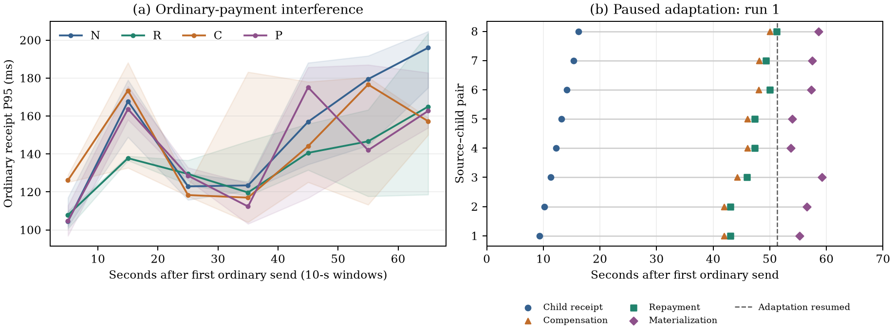

# 最终版本混合负载：普通支付与来源闭合

第③项评审补测。节点实现冻结于 `721800c7de0a6526f58501fb78823d99426b69cb`，直接复用[第②项连续支付实验](../final-continuation-2026-10-02/README.md)的节点二进制和 Comet overlay。本轮只扩展实验客户端的可选事件记录和离线审计统计。

## 问题与四组对照

**普通付款持续进行时，来源补交、到期赔付、迟到回款和历史修复能否完成，各阶段对普通付款有多大干扰？**

| 组 | 原来源交付 | 自动补交 | 适配服务 | 要区分的机制 |
| --- | --- | --- | --- | --- |
| N | 正常 | 开启 | 正常 | 相同父子付款及观察负载的基准 |
| R | 扣留发布者 Submit 和 INSTALL | 开启 | 正常 | 公开子交易暴露证据后自主补交 |
| C | 同样扣留 | 关闭 | 正常 | 到期赔付后，驱动释放迟到来源 |
| P | 同样扣留 | 关闭 | 全部暂停，随后恢复 | 赔付和回款与历史表示修复分离 |

每组包含相同的 8 对跨组织父子付款：组织 A 认证父付款，组织 B 认证消费该输出的子付款。普通流与这些付款使用独立的创世输入及 Intent。R 的驱动不提交父交易；C/P 对每一项独立观察赔付，再释放该父交易，不等待其他责任或历史物化。

P 只有在 **四委员 × 八目标**全部确认已回款、表示仍未提交且未物化后才恢复适配。恢复后的物化也须落在普通流实际发送窗口内。N 也运行同样的八对付款，避免将额外付款量误当作故障处理开销。

## 固定配置与测量方法

- Mac Studio M4 Max，16 核、64 GB，14 个同机服务：4 委员，2 个组织各 4 成员和 1 网关。
- 委员会应用数据库、共识数据与网关落盘，成员同步 bbolt 提交。普通流钱包 NoSync；父子场景钱包同步提交。全部组相同，不混作全系统耐崩溃测试。
- commit 参数 250 ms，flush/gossip 各 10 ms。成员 `GOMAXPROCS=16, GOGC=200`；轻量结算时间戳开启，逐阶段高频 trace 关闭。
- 每轮普通流计划 100 TPS、7,000 笔，快速并发 64，总未完成上限 256。实际发送滞后与上限阻塞照实记录。
- 从压测客户端启动后第 10 秒起，每秒启动一对父子，共 8 对；实际相对普通流的时间由事件记录复核。八对独立运行，不串行等待赔付。
- 每个场景钱包至少保持 55 秒跟块，统一各处理的观察进程寿命。每轮结束还等待普通流闭合、场景完成及排空。
- 每组 3 次独立运行，顺序为 N/R/C/P、P/C/R/N、N/R/C/P。复制同一未运行创世与密钥，逐轮重置创世时间、使用新数据目录。
- 各组织 CAL、FUEL 初始备付及各授权均为 `10^12` 单位，固定、不自动补资。复用现有 `bench-v4/demo-v4` 的**显式授权组织代付 FUEL**；本轮评价组合路径，不评价用户付费或有限资本效率。

快速到账：付款钱包实际发送 → 收款钱包验证 TXCer 并完成本地事务。公共观察与成员关闭包含跟块、查询和轮询。父子事件中的赔付、回款、表示及物化均为**观察时间**，不是内部提交时间；采样请求保存起止时间，暂停恢复单独记录。

普通流按逐轮 P50/P95/P99 和每 10 秒窗口统计；跨轮汇总是三个运行统计量的中位数及范围。图中的区间为三轮最小—最大值，不是置信区间。一秒资源采样只支持采样极值；结束留存量只支持结束快照，不推断长期增长率。

## 结果与证据

**十二轮全部通过：84,000 笔普通付款、192 笔父子付款，共 84,192 笔成功并完成审计。** 24 个被扣留来源由成员自动补齐；48 项来源责任完成赔付与等额回款。暂停组的全部 24 项在四副本确认回款、历史表示仍未提交时解除暂停，随后完成修复。每轮普通付款的实际发送窗口覆盖了这些事件。

### 普通付款表现

下表每格是三轮相应统计量的中位数；完整逐轮数值见 [runs.csv](runs.csv)。快速收款与后台观察分开计时，不能把整轮约 71 秒当成一笔交易延迟。

| 处理 | 到账 P50 | 到账 P95 | 到账 P99 | 实际发送跨度 | 最后发送后后台排空 |
| --- | ---: | ---: | ---: | ---: | ---: |
| N 正常 | 55.13 ms | 152.77 ms | 243.87 ms | 70.245 s | 1.015 s |
| R 自动补交 | 53.03 ms | 139.89 ms | 220.06 ms | 69.990 s | 0.890 s |
| C 赔付、适配正常 | 54.01 ms | 136.49 ms | 227.58 ms | 70.395 s | 1.029 s |
| P 赔付、适配暂停 | 55.00 ms | 144.21 ms | 227.52 ms | 70.576 s | 1.155 s |

四组到账中位数接近，普通流在来源闭合期间持续完成。**不能将分位数较低直接解释为故障使系统更快：** 三轮存在运行波动，且有限并发带来发送背压。N/C 三轮及 P 两轮都曾触及 256 个总未完成任务上限；P 两轮还触及快速并发 64 上限。全程无预算拒绝，但压测器会等待空名额。

| 处理 | 三轮发送滞后 P95（ms） | 前 70 秒的单轮分窗最大到账 P95 |
| --- | --- | ---: |
| N | 255.40 / 110.39 / 0.24 | 204.66 ms |
| R | 0.24 / 0.22 / 0.19 | 203.69 ms |
| C | 201.34 / 700.33 / 405.30 | 188.18 ms |
| P | 895.88 / 0.24 / 586.54 | 187.02 ms |

十二轮最后发送后的普通任务排空范围为 **0.815–1.356 s**，最终没有剩余任务或 outbox。该结果支持所测有限混合流能够完成及排空，不代替严格无背压的持续容量测试。发送拖至 70 秒之后的尾段另保留在 [windows.csv](windows.csv)：P 第 1 轮尾段 89 笔的到账 P95 为 **282.61 ms**，不是一个满 10 秒窗口；不与前七个窗口混画。队列原始轨迹随各轮 `bench-v4-100.json.gz` 保存。



图左：首发后前 70 秒七个窗口的普通到账 P95，线为三轮中位，阴影为最小—最大；各窗口样本数见 CSV。图右：固定展示第 1 轮 P 组的八项独立责任；横轴从普通首发起算，展示先收款、后赔付与回款、恢复适配后物化的观察顺序。[矢量 PDF](mixed-load.pdf)

### 来源与资金处理

| 处理 | 正式目标数 | 观察到的路径 | 从子首次实际发送起算 |
| --- | ---: | --- | --- |
| R | 24 | 原发布者不补交，成员从公开子交易恢复父来源；全部 Fulfilled，零赔付 | 来源成立 2.054–3.357 s，中位 2.905 s |
| C | 24 | 子先公开；到期赔付；驱动逐项释放迟到父来源；原发行组织回款；完成修复 | 赔付 32.190–34.499 s；回款 33.264–36.639 s |
| P | 24 | 全部适配端点暂停时先赔付和回款；四副本全部确认后恢复适配；随后物化 | 赔付 31.806–34.362 s；回款 32.955–35.943 s |

以上范围是各组 24 个目标的描述性事件统计，不把同轮八个目标当成八次独立系统运行。30 秒是公共义务期限，赔付观察还包含锚定、调度、公共执行和轮询。

P 三轮在普通首发后 **51.256 / 51.462 / 51.792 s** 解除暂停；此前所有 **96 份副本×目标检查**均为 `Recovered` 且 `Committed=false, Materialized=false`。恢复后的全部修复均在普通流最后一笔发送之前完成。因而支持的核心判断是：**所测缺失来源的赔付和回款不依赖适配服务可用，历史表示可以随后完成，普通付款无需等这些责任逐项关闭。**

四组最终用户 CAL 分配相同。C/P 共支出 4,800 CAL 并回收 4,800 CAL；最终各组织备付恢复，CAL 及工作权限无残余占用。每轮四委员在相同静止高度观察后通过状态哈希一致、总量守恒、7,016 笔费用关闭与历史身份审计。

| 每轮费用 | N / R | C / P |
| --- | ---: | ---: |
| 节点报酬 | 589,344 FUEL | 589,384 FUEL |
| 销毁 | 70,160 FUEL | 70,160 FUEL |
| 实际总费用 | 659,504 FUEL | 659,544 FUEL |

C/P 每轮多 40 FUEL，恰为八项各 5 FUEL 的额外修复费用。实际费用仍由代付账户支出，不能把费用核销写成资金无成本恢复。逐成员 FUEL/Policy 残余包含真实已支出费用；与 CAL、工作权限分别解释。

结果由 [analyze.py](analyze.py) 从逐笔数据重新计算，全部断言通过，见 [analysis.json](analysis.json)、[targets.csv](targets.csv)、[resources.csv](resources.csv)、[retained.csv](retained.csv)。资源轮询无错误；所有成员预算拒绝计数为零。读者微基准属于后续独立步骤，本轮未扩展。

留存指标的范围是成员 `KeyInstall` 与网关 `KeyCollected` 中的完整付款记录及其中新签 TXCer 的编码字节，不包含钱包、批准记录中的直接输入证书、数据库页开销或全部历史空间；副本记录数不能当成唯一证书数。初始未运行创世没有这些记录。

## 复现与审计

```sh
python3 run.py --root /path/to/mixed-source --frozen /path/to/final-continuation-build
python3 collect.py /path/to/mixed-source
python3 analyze.py results
python3 plot.py
```

`--frozen` 指向第②项构建目录，包含 `bin-final` 和 `results/build.json`。混合源目录以同一源包准备，只有 `cmd/payctl/direct.go` 与 `cmd/payctl/audit.go` 的观测补丁；脚本在运行前逐文件检查此边界并检查全部旧二进制哈希。全部节点使用旧二进制，新 `payctl-mixed` 用于驱动与审计。

审计核对付款数、费用关闭、CAL/FUEL 守恒、四副本状态、原始扣留残余与 Worker 额度、来源发行组织及金额、赔付/回款次数与备付恢复，以及历史身份检查。每轮预期为 **7,016 笔成功付款**，不把投递尝试计成付款。`auditDirectHistory` 检查修改后的历史；观察端点的 `IdentityStable` 不单独替代完整密码学论证。

完整数据库与测试私钥保留在 Mac 的独立实验目录，不放入证据包。包内大 JSON/日志无损 gzip，`manifest.json` 记录解压前原始内容的长度和 SHA-256。预检的两对场景与 6,000 笔普通付款不计入正式样本。
