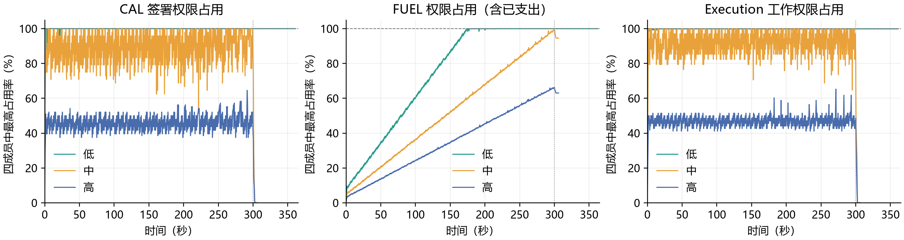
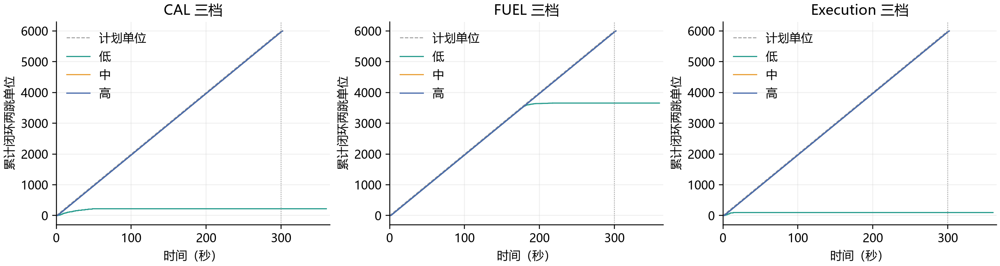
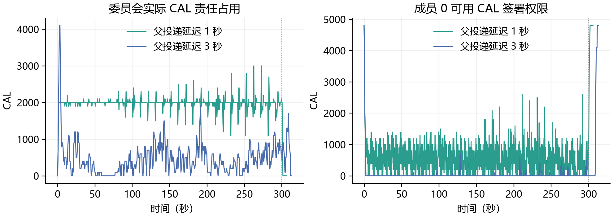

# E2：有限资金与权限周转

本实验使用独立两跳付款，检验有限 CAL、FUEL 和工作权限能否正常释放、继续服务，以及低预算下出现何种阻塞。它不测最大 TPS，不检验激励相容或市场盈利。

**原始矩阵已完成。** 中高预算六组均完成 6,000 个两跳单位，已成证付款能够正常结算和释放临时权限；低 CAL 和低工作权限暴露了未成证部分批准占用的问题。低 FUEL 还受到真实费用逐步消耗授权的限制。针对部分批准的单入口取证对照正在另行验证，不能用中高档成功掩盖低档问题。

[实验设计](../../research/finite-budget-experiment-design-2026-09-23.md) · [复现脚本](reproduce.py) · [统计脚本](analyze.py)

## 原始矩阵结果

每组计划 6,000 个两跳单位。下表“闭环”要求父、子均公共完成且成员完成自己的收尾；“部分批准”按交易计数，仅有一票或两票而未形成完整凭证，不能与业务单位直接相加。全部已完成组均通过四委员状态一致、公共资金缺口为零及逐笔费用审计。

| 原方案配置 | 启动单位 | 未启动单位 | 完整闭环单位 | 公共付款 | 未成证部分批准交易 |
| :--- | ---: | ---: | ---: | ---: | ---: |
| CAL 低 | 352 | 5,648 | 224 | 498 | 66 |
| CAL 中 | 6,000 | 0 | 6,000 | 12,000 | 0 |
| CAL 高 | 6,000 | 0 | 6,000 | 12,000 | 0 |
| FUEL 低 | 3,784 | 2,216 | 3,656 | 7,393 | 54 |
| FUEL 中 | 6,000 | 0 | 6,000 | 12,000 | 0 |
| FUEL 高 | 6,000 | 0 | 6,000 | 12,000 | 0 |
| Execution 低 | 235 | 5,765 | 107 | 274 | 82 |
| Execution 中 | 6,000 | 0 | 6,000 | 12,000 | 0 |
| Execution 高 | 6,000 | 0 | 6,000 | 12,000 | 0 |
| CAL 中，父延迟 3 秒 | 1,438 | 4,562 | 1,438 | 2,876 | 0 |



图中每条线是该时刻四成员中最高的权限占用率，不是四份权限相加。FUEL 曲线包含已付费用形成的净支出；支付结束后不会回到零。300 秒竖线后为排空期。



### 发现一：足额周转成立，低档暴露部分批准堵塞

中高档六组每组 12,000 笔付款均正常结束、临时占用归零。它们支持“五分钟固定负载下，已成证付款能够恢复权限并服务后续付款”，不支持“任何预算下都可以满速运行”。

低 CAL 组结束时，36 个交易各有一份批准，30 个各有两份，共 96 次成员占用，恰好占满四成员各 24 笔、每笔 100 CAL 的权限。不存在已取得三票却未组装的残留交易。实际组织备付仍为 3,600 CAL、公共缺失责任已清零，瓶颈是未成证请求分散占用签署权限。

低 Execution 组同样存在 32 个一票、50 个两票交易；各成员只剩 1–7 个工作权限，低于下一笔父/子的 17/27 需求。已公共付款全部完成，却无法靠它们再释放足够权限。重试原请求不会凭空解除其他请求的批准记录。

### 发现二：FUEL 的实际支出不能当临时占用恢复

低 FUEL 组公共付款实际消耗 694,942 FUEL，其中报酬 621,012、销毁 73,930；未使用预留退回 6,698,058。各成员剩余 FUEL 权限为 54 / 866 / 960 / 960，均不足下一笔最大预留 1,000。这里同时存在部分批准残留和累计实际费用消耗，不能全部归因于核销慢。

这笔费用覆盖全部 7,393 笔公共付款：除 3,656 个完整两跳单位外，还包括 81 笔已成立但子未完成的父付款。因此不能用“闭环单位数 × 两跳费用”代替账本实际费用。

因此有限费用授权只能支持有限的真实支出。要长期运行，需有付款方的持续费用收入及相应真实余额、授权补充；本实验没有给运行中的节点充值，也没有把已付费用恢复成未花的钱。

### 发现三：后台变慢会降低可接受负载，但不一定永久卡住

CAL 中档不变，仅将父投递延迟从 1 秒增到 3 秒，完成单位由 6,000 降到 1,438，窗口满导致 4,562 个计划单位未启动。已启动单位在停止输入后全部结束，无部分批准残余；这组是周转等待与重试放大，不是最终永久停滞。



低预算还会改变真正的担保使用比例：CAL 低档只有 88/224 个成功子付款实际建立了缺失输入责任；CAL 中档 3 秒组为 551/1,438；CAL 中高档 1 秒组均为 6,000/6,000。其他子付款因等待而遇到父已上链，合法完成，但不算新发生的缺失输入责任。不能把更小的公共占用解释为更好的担保资金效率。

### CAL 资金使用指标

只累计子付款的 100 CAL，不将父子两跳重复算作有效支付额。下表截点是钱包在 300 秒输入期内已观察到公共成功的子付款，不是精确区块 Commit 截点，也不包含排空期才观察到的付款。

| 原方案 CAL 配置 | 输入期观察到成功的子付款 | 其中实际建立缺失责任 | 每 CAL 备付每秒支持的有效支付额 | 其中真实缺失责任支付额 |
| :--- | ---: | ---: | ---: | ---: |
| 低，1 秒 | 224 | 88 | 0.02074 | 0.00815 |
| 中，1 秒 | 5,987 | 5,987 | 0.27718 | 0.27718 |
| 高，1 秒 | 5,987 | 5,987 | 0.13859 | 0.13859 |
| 中，3 秒 | 1,318 | 513 | 0.06102 | 0.02375 |

后两列单位均为 CAL / 初始备付 CAL / 秒。中档与高档在该负载下完成量接近，因此更多备付没有带来更多有效付款；这不是最高可支持负载的测量。

例如高 CAL、1 秒组的公共 CAL 占用采样均值约 1,994，责任进入速率约 20/s、每项 100 CAL，对应约 1 秒的平均持有量级。它符合 `平均占用 ≈ 进入速率 × E[金额 × 持有时间]` 的稳态解释，只是同一组记录的校准，不能替代逐项生命周期测量或用于保证瞬时峰值。

## 最小改动：单入口顺序取证

为减少新请求继续制造部分批准，增加默认关闭的 `UTXO_EXPERIMENT_SERIAL_DIRECT=1`：一个请求未取得完整三票时保留取证入口；其他请求暂缓进入成员验证。原请求拿到有效凭证并保存可重取结果后，才交给下一个请求。每笔内部仍向四成员并行请求三票，INSTALL、父的独立投递定时器、公共结算和成员跟块都继续并行。

这项改动不清理旧批准、不归还未满足条件的预算、不要求委员会通知成员。已完成结果先于入口限制查询，丢失响应的旧请求可以重取；正常付款的已保存结果与 outbox 分开处理，避免取证保存阻断之后的公共投递。

新配对轮父、子都经过同一个网关入口，只有开关不同；与原 `r3` 父由驱动直连成员的路径区别明确。因此改动效果只从 `gate-r1` 各对内部比较，不直接用它减去 `r3`。

已完成前两对显示：低 CAL 闭环单位 86→3,203、部分批准 65→0；低工作权限闭环单位 265→3,903、部分批准 74→0。顺序组已启动单位均完成并清空临时占用，但仍有计划单位因窗口满而未启动。剩余配对结束后统一列出完整表格。

适用范围是全新单 Collector、合法输入、已有证书继续正常结算的实验。它不会回收并行旧轮留下的锁，也不保证多网关、重启或请求永久放弃时的推进。真实 FUEL 已支出后仍需要实际费用供给，不能靠入口顺序无限恢复。默认高速路径保持原样，顺序模式的最大 TPS 未在本实验中测量。

## 实验条件

- Mac Studio M4 Max（16 核、64 GB），单机九个服务：四委员、四成员、一个网关；三个钱包在独立驱动进程中运行。
- 每单位为 A→B→C 两笔真实付款，每笔 100 CAL。父使用独立最终输入；B 收到并验证父 TXCer 后，子使用该未确认输入。
- 父通过真实成员取证后，由驱动固定延迟 1 秒投递；子走正常网关。对照将父延迟改为 3 秒，父投递不依赖子交易成功。
- 固定 20 单位/秒，即最多 40 笔付款/秒。最多 128 个未完成单位；窗口满计为驱动未启动，节点预算拒绝单列。
- 每成员一个 Worker，排除 Worker 分片的影响；没有在本轮实现或验证跨 Worker 调配。
- 预算轮沿用内存节点与钱包 NoSync；两个费用小序列保留委员会磁盘区块，用于停机后的真实历史改写审计，不据此比较性能。

这是一项受控的责任周转实验：驱动代行父收集器并控制传播时机。不能将其速率与完整系统 TPS 实验直接比较。

## 已完成的前置核验

子交易先公共成立后，实际登记 100 CAL 责任；父随后成立，责任解除，CAL 未发生支出。30 秒高预算校准中，600 个两跳单位、1,200 笔付款全部完成，600 项真实责任正常解除；没有预算拒绝、驱动未启动或部分批准残留。

三秒父延迟的高预算容量检查同样完成 600/600 单位，未出现驱动未启动。它用于排除 128 窗口本身限制目标输入速率的混杂。

## 预算档位

正式轮使用 `r3-*` 前缀；先前 `probe`、`r1-*`、`r2-*` 是工具调试和诊断记录，不混入正式对照。

| 变化维度 | 组织 Grant：低 / 中 / 高 | 每成员实际权限：低 / 中 / 高 |
| :--- | ---: | ---: |
| CAL | 3,600 / 7,200 / 14,400 | 2,400 / 4,800 / 9,600 |
| FUEL | 1,073,520 / 1,789,200 / 2,683,800 | 715,680 / 1,192,800 / 1,789,200 |
| Execution | 1,122 / 2,244 / 4,488 | 748 / 1,496 / 2,992 |

CAL 同时调整实际备付与签署授权，因此是联合分档；FUEL 只调整授权，真实账户固定充分。其他维度均保持充足。成员权限为 `floor(2 × Grant / 3)`，四成员相互重叠，不能相加当作真实本金。

## 费用审计

下表按**单笔子付款**统计，父付款在两条路径中均另付 94 FUEL。每个小序列在子付款完成后额外重投三次相同封装，公共账本仍只有两笔付款，没有新增收费。

| 子付款路径 | 预留 FUEL | 实际消耗 | 退回 | 节点报酬 | 销毁 | CAL 赔付 |
| :--- | ---: | ---: | ---: | ---: | ---: | ---: |
| 父正常到达 | 1,000 | 94 | 906 | 84 | 10 | 0 |
| 父逾期赔付、随后迟到 | 1,000 | 99 | 901 | 89 | 10 | 100 |

赔付组四委员均完成一项历史修订，停机审计验证修订正文、认证、分片承诺和历史 BlockID；状态哈希一致。已赔付的 100 CAL 保留为净支出，不因父迟到而恢复成可用备付。当前迟到输出的经济语义沿用既有协议，本实验不将它证明为市场可持续机制。

## 统计口径

- `Reserved` 是尚未恢复的签署权限，可能同时包含临时占用与已支付费用。临时占用用实际 Debit 的 `Charged − Released − NetSpent` 计算，已付费用另列。
- 预算拒绝来自成员实际资源检查位置的累计计数，包含重试。HTTP 503 本身不被认定为某个资源不足。
- 驱动未启动比例、已启动付款发生重试的比例、部分批准残留分别报告；重试后成功的付款也保留等待时间。
- 公共 CAL 按唯一责任记录累计。低预算可能让子变慢、父先成立，必须同时展示实际触发缺失责任的比例，不能将较小占用简单解释为更高效率。
- 正式轮输入 300 秒，最多再排空 60 秒；不得补资、修改 nonce 或清锁来消除低档残余。
- `Oldest` 记录活动责任的输出身份、锚定高度和到期时间；等待下一高度锚定的 Deadline=0 不代表没有责任。固定延迟检验使用单调时钟，Unix 时间仅用于事件定位。
- 公共最老责任与未取得凭证的最老请求分别记录：公共责任清零不代表未成证批准已经消失。`analysis.json` 中同时保留停止时未 READY 请求年龄及已 READY 未收尾请求年龄。
- 到账 P50/P95 从子钱包首次发送到验证并接收凭证，包含同请求重试，但只统计最终取得凭证的子付款。未成功请求另列，不以低成功率组的低中位数宣称延迟更好。

采样每 500 ms 读取固定账户和 Slice，累计明细每 10 秒扫描一次；它是实验观测，不是每笔业务新增工作。原矩阵常规读取大多低于 1 ms，12,000 笔组的明细读取最大约 619 ms，采样无错误。明细扫描存在开销，因此这些带采样结果用于周转与边界分析，不作为无观测扰动的性能上限或精确预算阈值。

## 实现与验证范围

新增 `payctl budget-v4`、`budget-audit`，复用现有真实钱包、成员取票、公共交易提交和按块观察。`/debug/budget` 及父取证专用端点均需显式实验开关；预算拒绝计数放在实际资源不足的位置，不改变预算裁决。所有新实验从创世启动，没有取消旧批准、运行中加钱或修改委员会共识。

单入口顺序取证使用已有 `Collected` 保存可重取的完整结果；保存结果与生成 outbox 独立处理，已验证公共完成后不复活投递任务。新模式默认关闭，仅作为低预算对照，现有高吞吐默认路径没有启用这个入口限制。

Mac Studio 上已通过全项目 Go 测试、网关/驱动/预算采样/成员的定向 race 与 `go vet`；日志分别为 `gate-tests-mac.log`、`gate-race-mac.log`、`gate-vet-mac.log`。正常与赔付小序列还验证了真实网络和历史修订路径。代码格式、补丁空白检查及本地 E2 定向测试通过。

Windows 的既有 `TestProgressBatchIndividualCancellation` 仍出现 `missing separate timing` 断言失败，该测试与进度批处理源文件本轮未修改；Mac 同一测试通过。本轮未把它包装为全部平台测试通过，也未为该既有时间断言扩大业务补丁。

## 证据与限制

- `r3-*`：原始九档、一个延迟对照、两个费用控制、校准与窗口检查；原始源码增量见 `r3-source-over-385a057.tar.gz`，相对于 `385a057`。
- `gate-r1-*`：相同父网关入口下的开关配对及两个费用控制。每次配置保存实际二进制 SHA-256；`source-manifest.json` 与 `gate-source-manifest.json` 分别记录两套源码与二进制指纹。
- 每个案例包含 `configuration.json`、公开创世网络信息、`samples.jsonl`、逐笔 `budget-v4.json`、停机 `audit.json` 与 `budget-audit.json`。较大 JSON/JSONL/日志用 gzip 无损压缩，统计脚本直接读取；不提交运行私钥和数据库。
- `r3-summary.csv`、`gate-r1-summary.csv` 提供表格，逐节点时间线位于对应 `*-curves.csv.gz`，累计核对见对应 `*-verification.json`。`data-manifest.json` 提供文件及解压正文校验值。
- 每配置的一轮运行不是独立重复的统计总体；单轮内大量交易和时间窗口不能充当独立实验重复。关键对照仍需进一步重复后才报告置信区间。
- 本轮不验证 Worker 间调配、多网关活性、断电恢复、广域网性能、激励相容或长期盈利；赔付小序列也不构成完整协议安全证明。

## 复现

在 Mac 仓库根目录执行，各次使用未出现过的前缀：

```sh
python3 docs/experiments/finite-budget-2026-09-23/reproduce.py --case fee --prefix myrun-
python3 docs/experiments/finite-budget-2026-09-23/reproduce.py --case calibration --prefix myrun- --skip-build
python3 docs/experiments/finite-budget-2026-09-23/reproduce.py --case window-check --prefix myrun- --skip-build
python3 docs/experiments/finite-budget-2026-09-23/reproduce.py --case matrix --prefix myrun- --skip-build
python3 docs/experiments/finite-budget-2026-09-23/analyze.py --prefix myrun- --plot
```

绘图需要 matplotlib；Go 支付系统没有新增依赖。每轮保存配置、二进制指纹、500 ms 快照、10 秒累计明细、逐笔记录和停机审计。原始目录在采样完成前不能作为正式结果。

当前分支的新配对复现（保留已发布的 `calibration.json` 档位，不在两臂之间重新校准）：

```sh
python3 docs/experiments/finite-budget-2026-09-23/compare_gate.py --case smoke --prefix mygate-
python3 docs/experiments/finite-budget-2026-09-23/compare_gate.py --case pairs --prefix mygate- --skip-build
python3 docs/experiments/finite-budget-2026-09-23/analyze.py --prefix mygate-
python3 docs/experiments/finite-budget-2026-09-23/verify_results.py --prefix mygate-
python3 docs/experiments/finite-budget-2026-09-23/plot_comparison.py --prefix mygate-
```

严格重放原 `r3` 源码时，在独立的 `385a057` 检出上覆盖所附源码增量，复制本报告的 `calibration.json` 后构建并运行矩阵；当前候选源码不能冒充原始源码。若重新校准，则保存新的档位，报告为另一轮实验。
