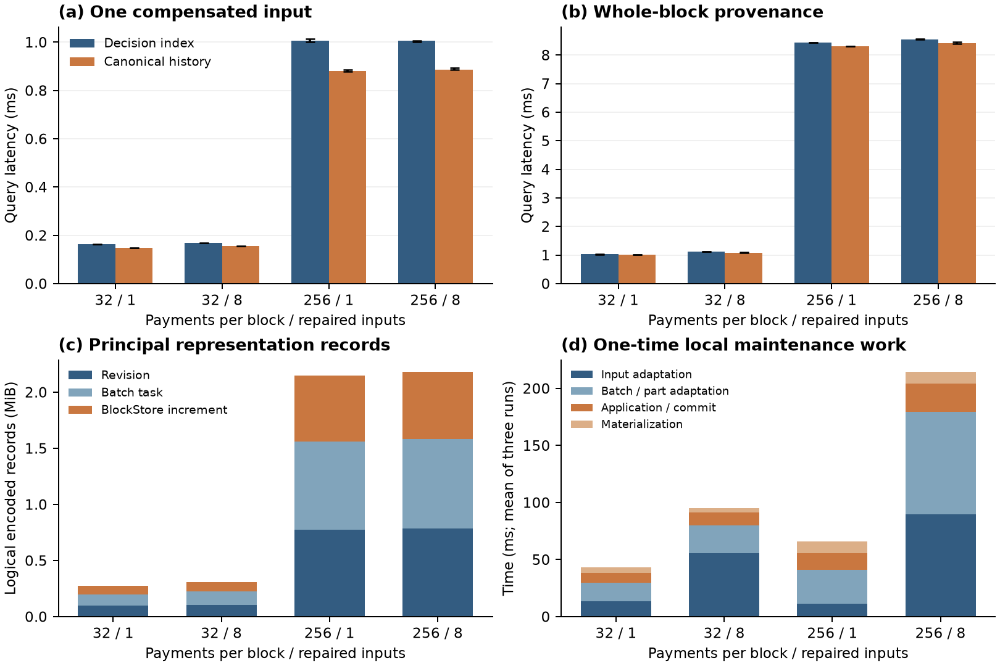

# 历史读取对照：决定索引与授权修订表示

第④项评审补测，2026-10-02。生产实现与②③相同，冻结于 `721800c`；本轮源码归档来自 `0d90417`，新增内容全部是测试和报告。没有修改协议、节点热路径或历史读取函数。

## 结论

**优化决定索引与修订历史能够给出相同的经济解释；修订历史在当前布局下减少部分块重建开销，同时付出额外表示存储及适配成本。** 三个独立进程完成十二个夹具、21,600 次成对交错计时查询。

- 已赔付输入点读：修订历史 P50 比索引路径低 **7.44%–12.32%**，绝对差约 **12.6–123.8 μs**。
- 整块读取：P50 差异 **1.49%–3.88%**，主要工作仍是交易解码，两条路径接近。
- 一次表示工作：各配置三轮总工作耗时的中位数 **43.3–214.4 ms**；为本地顺序适配、执行、应用同步提交及物化，不含网络或共识等待。
- 当前实现为每个被修复块增加约 **0.28–2.19 MiB** 表示相关净逻辑记录，主要来自整块 Revision、BatchTask 和 BlockStore 原历史备份。该数不是单个输入成本或全系统磁盘增长率。

因此，第三项的直接收益是：**原坐标下提供已授权、保持原身份的资金表示，并将表示维护放在经济闭合之后。** 本实验量化这一接口选择的读取和维护取舍；不将历史改写说成正确赔付的必要条件，也不把同一布局下的差别推广为对所有追加式索引的性能优势。

## 对照契约与实现

沿用[历史读者契约](../../design/historical-reader-contract.md)。读者是已验证并执行公共前缀 H 的诚实副本，两个策略在同一应用读事务中读取 H；查询只给原坐标 `(h,j,k)`。BlockStore 在计时期间冻结。

| 策略 | 实际路径 | 共同返回值与授权保证 |
| --- | --- | --- |
| A：优化决定索引 | `LoadOriginalBlock`；点读按 OutputID 直接查永久 `DirectRepairTodo`；整块一次范围扫描该块 `DecisionIndexKey` 并建立本次 map，只对命中项取决定 | H、原坐标、原输入、TxID、金额、历史经济来源／Debit、成功决定／高度、当前义务状态 |
| B：修订历史 | 原有 `Canonical` 从 `Revision.Body` 读取已提交表示，无修订则读原块；再关联相同的永久决定与义务 | 相同；修订字段本身不能代替公共授权 |

A 不全链扫描，也不反复扫描决定表；map 构建计入本次查询，不在测试前免费注入。B 不额外加载原块。A 使用独立的未物化 BlockStore，避免让对照承担 B 的备份读取布局。两者共用同一已执行应用前缀；这是两个本地读取策略的对照，不是两套重新部署的完整协议。

原始 `Funding`、修订号、物理安装进度是表示元数据，不强求两边逐字相同。已赔未表示时，B 仍可有 `OriginalFunding`，但共同返回值会根据成功决定反映备付垫付。回款后保留历史垫付来源，当前状态为 `Recovered`。

**点读也有整块加载成本。** 现有 API 以原块坐标定位，先加载块，再只解码选中的付款；没有给 A 预先提供正文或决定。双方使用热 OS／数据库页缓存，均无已解码块缓存或查询结果缓存。测量对象不是已知 OutputID 时单独一次 KV Get 的最低耗时。

## 环境、数据与统计

- Mac Studio M4 Max，16 核、64 GiB；Go 1.27.1 darwin/arm64，`GOMAXPROCS=16`、`GOGC=100`。
- 真实磁盘 bbolt 应用状态，真实 GoLevelDB BlockStore；应用使用同步提交。没有网络服务或负载发生器参与本项计时。
- 每块 32 或 256 笔真实签名付款，其中 1 或 8 笔使用缺失父来源。测试使用项目真实的所有者／组织签名、3/4 委员提交签名及 3/4 RSA 适配份额；公钥／份额初始化与交易构造不计入读取或维护时间。
- 高度 1 执行目标付款，高度 2 推进公共时间，高度 3 成功执行到期赔付，高度 4 成功执行表示命令。原 ABCI `FinalizeBlock`／`Commit` 产生应用状态，没有直接伪造已授权记录。
- 正式读取固定在 H=4、已表示并物化后；**其他阶段是功能等价断言，未混进读取样本**。测量结束后真实执行迟到父来源，检查回款后的等价结果。
- 每配置独立生成夹具；三个进程各四配置。每个配置测已赔槽点读、普通槽点读、整块读取，A/B 各预热 20 次，然后交错执行各 300 次。总计 12×3×2×300=21,600 次计时查询。
- 原始样本嵌套于进程／夹具，不能当成 21,600 个独立运行。表中数值为三个运行各自 P50 的中位数。分位数使用 nearest-rank；误差线是三个运行 P50 的最小—最大，不是置信区间。
- 总耗时包含开启／关闭读事务、读取和解码、授权记录关联与返回值构造。分段分位数不能直接相加。逻辑读取计数不等于物理磁盘 I/O；内存分配通过另 30 次查询的运行时计数差求均值。

## 读取结果

单位 μs；括号为当前点读减少比例，完整逐轮 P95/P99、普通槽及分段值见 [reads.csv](reads.csv) 和 [summary.csv](summary.csv)。

| 块内付款／已赔槽 | 点读 A | 点读 B | 整块 A | 整块 B |
| --- | ---: | ---: | ---: | ---: |
| 32／1 | 162.54 | 148.38（8.72%） | 1,028.29 | 1,005.79 |
| 32／8 | 169.21 | 156.62（7.44%） | 1,127.46 | 1,083.71 |
| 256／1 | 1,005.21 | 881.38（12.32%） | 8,441.58 | 8,316.00 |
| 256／8 | 1,006.25 | 887.25（11.83%） | 8,554.17 | 8,407.12 |

以 256／8 第一轮的已赔槽点读说明成本来源：A 调用 12 次 BlockStore 底层 Get，读出 622,183 字节；B 无 BlockStore Get，但从应用库读出包含整块正文的 Revision，应用总读出 825,526 字节。A/B 平均堆分配约 4.95／2.24 MB。授权关联段中位约 11.50／10.83 μs。

这说明收益主要来自**当前两种布局的块重建与解码路径**，不能解释成 B 不用读决定、不用验证授权，或变色龙哈希本身加速查询。整块查询摊薄了块加载差别，所以总差距较小。已解码对象缓存会改变这部分成本，本轮没有将其包含在已验证收益中。



[矢量图 PDF](reader-cost.pdf)。图 a/b：三个运行 P50 的中位数及 min–max；图 c：三个运行的主要逻辑记录字节均值，只画 Revision、BatchTask、BlockStore 增量，其他小记录及待办删除见成本表；图 d：本地各维护阶段的跨运行**均值**堆叠，因此与下表逐运行总耗时的中位数略有不同。

## 验证成本与保证

主测信任已执行前缀；原 `Canonical` 的全部实际工作保留。成功 `CompensationDecision` 授权经济扣款，成功 `RepairBatch` 及其 Revision／Task 绑定确切修订正文。相同哈希、同一个 Todo 或单个 CH 等式均不单独证明修订授权。

另从已经解码的对象测量两种独立重验，每种每轮 15 次，见 [reads.csv](reads.csv)：

1. **共同付款授权重验**：所有者授权、组织 QC 与 Fact 对应、直接输入证书签名；不调用要求 `OriginalFunding` 的原始提交验证器来误拒修订正文。
2. **各自输入 CH 等式重验**：分别检查原表示或修订表示中的实际引用与开口。

256／8 第一轮整块共同授权重验 A/B 约 **26.34／26.32 ms**，输入 CH 重验约 **10.30／10.32 ms**。另外，从已取得的正文与已授权分片开口重新计算完整 BlockID，两边约 **0.67 ms**，结果见 [identity.csv](identity.csv)。这些是独立计时项，不直接相加为网络请求延迟，也不把这组重验包装成外部无状态认证协议。

## 存储与一次维护成本

单位为字节和 ms；表中为三次对应总量的中位数。逻辑 KV 包含键和值。

| 付款／已赔槽 | 共同原始 BlockStore | 永久决定索引 | 永久决定记录 | 新增表示净 KV | 一次表示本地工作 |
| --- | ---: | ---: | ---: | ---: | ---: |
| 32／1 | 83,627 | 784 | 1,211 | 292,162 | 43.32 ms |
| 32／8 | 90,902 | 6,295 | 9,692 | 329,118 | 94.46 ms |
| 256／1 | 620,785 | 778 | 1,207 | 2,258,078 | 65.32 ms |
| 256／8 | 628,059 | 6,284 | 9,677 | 2,294,947 | 214.40 ms |

“新增表示净 KV” = Revision＋保存的表示命令＋BatchTask＋批引用／队列＋BlockStore 净增量 − 已删除 Pending。不含应用提交元数据变化；元数据在原始 JSON 单列。共同原始历史、成功决定和经济状态不重复算为表示的专属成本。不同随机份额／签名的十进制 JSON 编码长度可有几个字节差异，逐轮值全部保留。

256／8 的主要开销：Revision 823,209 B，BatchTask 837,677 B，BlockStore 增量 624,768 B。BlockStore 增量包含原始历史备份、维护块及其元数据；5,056 B 的 RepairBatch 命令已经包含其中，不能再重复相加。完整实验目录的文件大小也有记录，但该目录包含两份 BlockStore 和共同应用库，**不是两个独立方案的磁盘容量对照**。未实施历史裁剪或对象缓存。

| 表示工作阶段（中位 ms） | 32／1 | 32／8 | 256／1 | 256／8 |
| --- | ---: | ---: | ---: | ---: |
| 输入适配：取目标、三份份额、组合 | 13.37 | 55.92 | 11.24 | 89.69 |
| 批组装 | 1.36 | 5.04 | 4.40 | 24.07 |
| 分片份额与组合 | 14.81 | 18.92 | 25.55 | 65.47 |
| 表示 FinalizeBlock | 1.24 | 3.41 | 5.88 | 16.00 |
| 应用同步 Commit | 7.80 | 7.75 | 8.75 | 8.92 |
| 物化准备 | 0.37 | 0.32 | 2.00 | 1.89 |
| 物化安装 | 4.39 | 3.36 | 7.55 | 8.43 |

表内阶段中位数之和不是总耗时中位数。三个适配成员在本地顺序计算，所以这是**顺序工作量**，不是部署后三个成员并行 RPC 的响应时间。表示 Finalize 包含应用执行与现有检查，不冒称只有 `ExecuteBatch` 一次函数调用。公共块保存和提交签名的构造不在这项工作计时内；BlockStore 物化安装内部实际写入包含在安装项中。原始公共决定的 Finalize 与同步 Commit 为两策略共同的经济成本，另列在 [costs.csv](costs.csv)。

## 功能检查与复现

`TestHistoricalReaderEquivalence` 及每轮夹具检查覆盖：

- 已赔未表示、逻辑表示已提交未物化、物化后，两路径经济返回值相同。
- 完整 BlockID 保持；原输入、TxID 和经济来源逐槽相同；随后真正执行父来源，状态变为 Recovered，历史垫付身份仍保留。
- 错误坐标、把未来决定混入旧声明前缀、错误 Debit／金额被两边拒绝。合法旧前缀本身不是错误。
- 修订为 Reserve 却无决定、引用错 Debit 被拒绝；**不能解码**的 Revision 返回错误，不回退原版。该负例不等于任意可解码篡改均由生产 `Canonical` 检出。
- 两种表示的有效签名／QC 重验通过，篡改组织签名被拒绝；所有正式输入 CH 重验通过。

原始 ABCI 夹具是离线准备，不把它称为重新测量了分布式共识。既有 `internal/redaction` 整包测试与 `go vet` 也通过。独立分析脚本检查各运行状态、样本数、阶段顺序、统计层级和共同状态记录长度不变；它不替代密码学证明。

```sh
# 源树依赖与实验①②相同的 .scratch/comet-src overlay
python3 run.py --root /path/to/utxo-history-reader-721800c
# 下载 results 中日志及 JSON，不需要公开数据库或密钥
python3 analyze.py
python3 plot.py
```

测试源码：[reader_cost_test.go](../../../internal/redaction/reader_cost_test.go)。独立进程每轮使用新目录，拒绝覆盖旧结果。默认 `go test` 只跑小型等价测试，大矩阵需 `UTXO_READER_RESULTS` 显式启用。所有测试夹具库保留在 Mac 的 `/Users/richz/lab/man/utxo-history-reader-721800c/results/run*/`，证据包只包含公开成本数据。

材料：[方案](plan.md) · [分析结果](analysis.json) · [原始数据哈希](manifest.json) · [方法评审](gpt-method-review.txt) · [结果评审](gpt-result-review.txt) · [论文中英文段落](paper-snippet.md)。论文 TeX、PDF、Overleaf 尚待统一整合本轮数据。
