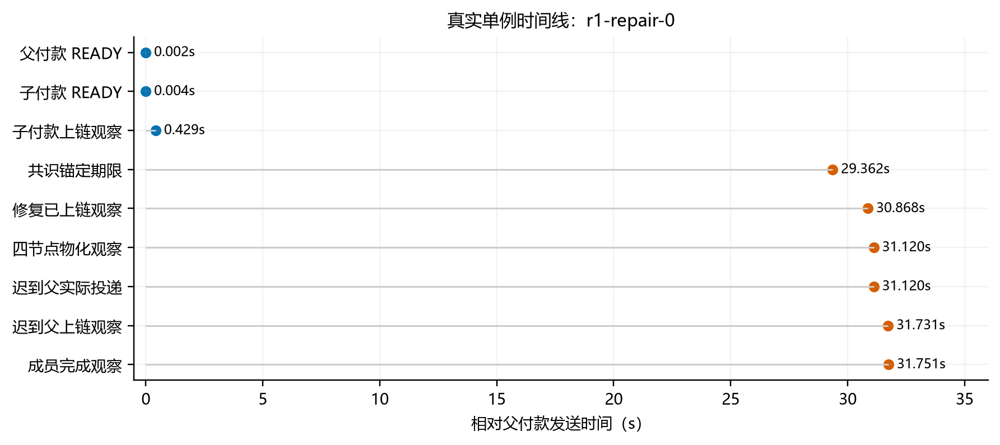
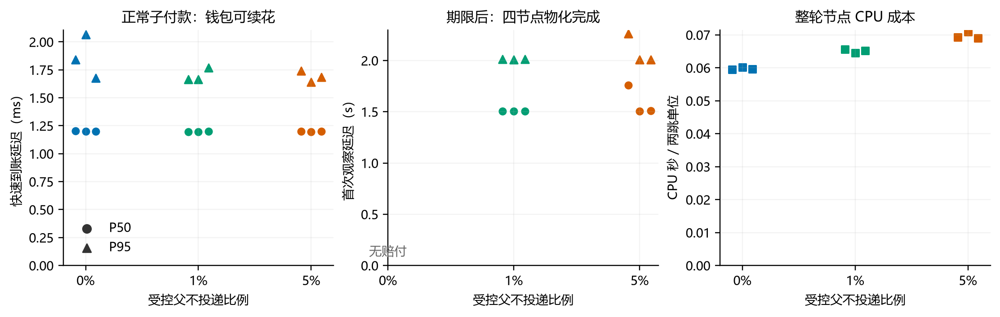

# E3：直接责任、赔付与历史输入修订

**实验已完成：十二轮网络控制、两轮校准和九轮正式对照全部通过。** 正式矩阵完成 **54,000 个两跳单位、108,000 笔付款、1,080 项唯一责任赔付**。结果支持所测条件下的直接责任兑现、后继支付有效性和受限历史输入修订，不是最高 TPS 或一般拜占庭安全证明。

[实验设计](e3-liability-repair-experiment-design-2026-09-23.md) · [九轮明细](matrix.csv) · [完整统计](matrix-summary.json) · [网络序列](sequence-summary.json) · [证据清单](evidence/manifest.json) · [GPT 最终评审](e3-network-final-review-2026-09-23.json)

## 1. 实验检验什么

A 向 B 付款，B 拿到经过认证的未确认输出后向 C 付款。我们故意扣住 A 的原交易，让 B→C 先上链。期限内原交易到达则正常解除责任；过期仍未到达，则从直接签发该输入 TXCer 的组织扣款，授权替换历史交易中相应的资金输入，保持交易身份与区块认证不变。

**异常组必须先观察到赔付已上链、四个委员实际改写历史输入，才释放迟到父交易。** 不能用“父交易最终到达，替实验兜底”解释结果。另设父永不到达和跨组织三跳控制，核对后继输出与直接责任归属。

本轮补齐实验驱动、只读物化观测、阶段埋点、逐笔账务分析与证据归档；没有为使实验通过而改变赔付规则、放宽验证、清锁或自动补资。

## 2. 环境与测量口径

| 项目 | 固定条件 |
| :--- | :--- |
| 硬件 | Mac Studio M4 Max，16 核 CPU、64 GB，同机多进程 |
| 主矩阵 | 一个组织：4 成员＋1 网关；4 委员；3 个钱包在 payctl 内分别维护状态 |
| 二进制 | 主矩阵冻结于检查点 `c1ebf2d`，哈希见 [build.json](build.json)；新增序列驱动单独构建 |
| 存储 | 委员会磁盘 BlockStore＋应用 bbolt；组织内存模式；钱包 bbolt NoSync |
| 共识参数 | Commit 250 ms，Flush/Gossip 各 10 ms；保留验签与真实修复处理 |
| 输入 | 20 两跳单位/秒，300 秒输入，每轮 6,000 单位、12,000 笔付款；最多 90 秒收尾 |
| 资金 | 每跳 100 CAL；组织账户和 CAL Grant 均为 60,000，每成员重叠签署上限 40,000 |
| 其他资源 | 用户自付最终 FUEL UTXO；组织无 FUEL/Policy 代付授权；工作权限充足 |
| 异常选择 | 每 100 个计划单位定额选择 0/1/5 个；种子 23/37/59；同种子 1% 集合包含于 5% |
| 父投递 | 正常父 READY 后约 1 秒；异常父等赔付及四副本物化后才投递 |
| 期限 | 既定共识锚点与 30 秒期限，不按本地 sleep 判断赔付合法性 |
| 限制与监测 | 128 在途单位；修复状态轮询 250 ms；节点 CPU 采样 2 秒；阶段日志开启 |
| 关闭项 | 自动补资、串行取证 |

异常比例的分母是 **6,000 个计划父交易／两跳单位**，不是 12,000 笔付款。三种子分别按 0→1→5%、1→5→0%、5→0→1% 运行。这是分层定额注入，不是独立随机故障概率或任意恶意节点测试。

四节点全部物化只是实验验收及迟到父释放条件，**没有把共识门槛改成四票**。成员额度相互重叠，不可相加作为真实备付本金。

- **快速到账／READY：** 以驱动的 `SentUnixNS → ReadyUnixNS` 计时，到收款钱包验证 TXCer 与输出绑定、完成本地原子接收。主矩阵子付款从请求保存和编码之后开始，仍包含 HTTP 前的资源摘要准备；父付款以及新增三跳控制还包含请求保存与编码。这些计时起点略早于实际 HTTP 调用，不是纯网络 RTT，也不含远端独立收款设备网络；本报告只比较同一驱动、同一路径的分位数。
- **公共完成观察：** 钱包从已验证公共区块观察付款成立，不是精确远端 Commit 时刻。
- **期限后物化观察：** 共识记录的期限，到首次观察四委员均改写历史输入；包含轮询、RPC、调度和共识处理。
- **完整轮次：** 300 秒输入加最后一项公共结算、成员收尾；异常组约 330 秒，不能写成全部在 300 秒内完成。
- **修复子阶段：** 输入份额、分片份额、提交、物化调用的墙钟耗时，包含重试；不同样本分位数不可相加。

## 3. 十二轮真实网络控制

每类独立运行三次，全部通过。时间为三次范围。

| 序列 | 核对结果 | 总用时 |
| :--- | :--- | ---: |
| 父在期限内到达 | 2 笔公共付款，责任正常解除；不赔付、不改写；费用 188 FUEL | 1.456～1.490 s |
| 赔付后父迟到 | 2 笔公共付款；先赔付、真实改写，再释放父；净损失 100 CAL，费用 193 | 31.751～32.076 s |
| 父永不到、后继继续付款 | 3 次 READY、2 笔公共付款；子孙先成立，赔付后后继仍为 100；再观察 3 秒 | 34.168～34.765 s |
| 两组织三跳、孙先到 | 3 笔公共付款；G1 的直接责任正常解除，G0 的另一项责任赔付 100；费用 287 | 32.090～32.621 s |

跨组织顺序：G0 签 T0、G1 签 T1、G0 服务 T2；先上链 T2，缺 T1 输出的责任归 G1；期限前提交 T1，解除 G1 责任；T1 缺 T0 输入形成独立 G0 责任，到期由 G0 赔付。**两项直接责任分别处理，不是责任转移，也不是整链只赔一次。**

永不到父案例保留明确的未决状态：未提交 T0 自身的费用输入锁和本地工作占用仍在，每名组织成员 Execution 临时残余 26、Bytes 临时残余 102,753；CAL 临时残余 0、净支出 100 保留。该父没有公共费用托管。两笔公共付款费用 193、退款 1,807，后继没有回滚或重复增加余额。此控制只在末尾检查成员完成，不代表连续测得最早完成时间。



[时间线 PDF](figures/repair-timeline.pdf)。图为真实 `r1-repair-0`，不是拼接的平均时序。约 30 秒等待来自协议期限；期限字段采用 Unix 秒和共识锚点，不能从付款发送时刻简单加 30 秒。已上链观察不等于精确 Commit。

## 4. 九轮混合负载结果

先完成 0%／5% 两轮 60 秒校准（各 1,200 单位），再以相同二进制和预算运行正式矩阵。以下每轮均 **6,000/6,000 单位闭环、12,000 笔付款成功，无漏发和最终业务失败**。分位数按单轮计算，没有平均三个分位数来冒充总体分位数。

| 种子 | 异常 | 赔付项 | 完整用时 s | 正常子 READY P50/P95 ms | 期限→四副本物化观察 P50/P95 ms | 在途峰值 |
| ---: | ---: | ---: | ---: | ---: | ---: | ---: |
| 23 | 0% | 0 | 301.817 | 1.203 / 1.841 | — | 46 |
| 23 | 1% | 60 | 332.437 | 1.197 / 1.663 | 1507.302 / 2011.444 | 52 |
| 23 | 5% | 300 | 331.843 | 1.198 / 1.742 | 1758.179 / 2261.118 | 75 |
| 37 | 0% | 0 | 302.018 | 1.201 / 2.064 | — | 46 |
| 37 | 1% | 60 | 329.857 | 1.196 / 1.665 | 1507.223 / 2009.788 | 52 |
| 37 | 5% | 300 | 332.313 | 1.196 / 1.639 | 1507.448 / 2010.033 | 77 |
| 59 | 0% | 0 | 301.950 | 1.198 / 1.678 | — | 46 |
| 59 | 1% | 60 | 331.628 | 1.198 / 1.770 | 1507.619 / 2010.907 | 53 |
| 59 | 5% | 300 | 332.312 | 1.201 / 1.685 | 1507.878 / 2009.894 | 77 |



[对照图 PDF](figures/mixed-load.pdf)。每个点是一轮结果，不是置信区间；CPU 包含整轮工作及收尾。

**正常子付款 P50/P95 未见明显恶化，但不能声称完全没有影响。** 全部付款中仍有最高 575.839 ms 的快速到账尖峰，0% 对照也出现约 550 ms 尖峰；本轮没有专门定位原因。种子 23 的 5% 组计划启动滞后 P95 为 12.465 ms，其余八轮为 1.540～4.551 ms，均未遗漏计划单位。

5% 三轮在途峰值 75/77/77，低于上限 128；按 60 秒到达窗口统计的修复观察 P50 未持续单调增长。说明本轮有限时间内未观察到失控积压，不能推论任意负载或无限期赔付都无积压。

## 5. 资金、费用与逐笔审计

每档三轮账务相同，金额为协议整数单位。每笔最大预留 1,000 FUEL。

| 每轮账务 | 0% | 1% | 5% |
| :--- | ---: | ---: | ---: |
| 初始组织 CAL | 60,000 | 60,000 | 60,000 |
| 实际赔付项数 | 0 | 60 | 300 |
| CAL 净支出 | 0 | 6,000 | 30,000 |
| 最终组织 CAL | 60,000 | 54,000 | 30,000 |
| 用户累计预留 FUEL | 12,000,000 | 12,000,000 | 12,000,000 |
| 实际费用（报酬＋销毁） | 1,128,000 | 1,128,300 | 1,129,500 |
| 节点／服务报酬 | 1,008,000 | 1,008,300 | 1,009,500 |
| 销毁 | 120,000 | 120,000 | 120,000 |
| 退回用户 | 10,872,000 | 10,871,700 | 10,870,500 |
| 最终公共费用 Held | 0 | 0 | 0 |

每轮费用为 `188 × 6000 + 5 × R`，CAL 净损失为 `100 × R`，R 为唯一实际赔付项数。退款不是收入，已赔本金不会因父迟到或权限核销而恢复成未损失资金。

九轮均通过以下检查：

- 每个选中父输出均对应真实 Repaired 责任；每笔费用 94，实际触发赔付的子付款另加 5。
- 所有退款均由钱包观察为最终输出；无部分批准残余。
- 每成员原始记录满足 `Charged − Released − NetSpent = 0`，**保留 NetSpent**。
- 委员会临时 Reserved 和公共 outbox Pending 均为 0，四委员终态一致。
- 核对真实 BlockStore 输入槽、稳定交易身份、BlockHash/DataHash/BlockID 与原 Commit；后继余额不重复增加。

5% 三轮最低采样成员可用 CAL 为 5,200 / 5,000 / 5,400，委员会占用峰值 5,700 / 5,800 / 5,800；成员额度不足计数均为 0。资金充足有实际观测支持，但累计赔付继续发生仍会消耗本金。

## 6. 修复工作量、重试与资源成本

下表给出三轮范围。调用延迟包含实际处理、等待及重试，不是纯密码运算或磁盘耗时。

| 指标 | 1%（每轮 60 项） | 5%（每轮 300 项） |
| :--- | ---: | ---: |
| 输入份额调用数 | 64～65 | 397～588 |
| 分片份额调用数 | 64～65 | 397～588 |
| Repair Submit 调用数 | 64～65 | 396～588 |
| 其中交易缓存重复返回 | 4～5 | 52～233 |
| 四副本物化调用数 | 240 | 1,200 |
| 每节点涉及旧块数 | 60 | 258～260 |
| 输入份额调用 P50 | 2.544～3.254 ms | 2.496～2.519 ms |
| 分片份额调用 P50 | 2.938～2.958 ms | 2.954～2.964 ms |
| 物化调用 P50 | 4.644～7.074 ms | 6.986～7.492 ms |
| 物化调用 P95 | 22.726～26.618 ms | 23.169～24.223 ms |

正式矩阵共 1,080 项唯一赔付、4,320 次成功物化调用，物化错误为 0。四副本改写不是四次赔付；同一旧块可以有多项修复。

输入份额累计调用 1,593 次（2 次错误），分片份额 1,591 次（2 次错误），Submit 1,589 次（366 次缓存重复返回）。重试没有重复扣款。成功提交返回也不等于唯一赔付，最终以已提交责任和账务为准。

Repair 命令编码 P50/P95 为 3,579 字节，5% 组最大 3,835 字节。5% 组按每项责任首次接纳命令计，合计约 1.074 MB；全部提交尝试为 1.419～2.106 MB。**未测全网传播字节和磁盘写放大**，物化调用耗时也不是 Write/Sync 分项耗时。

九节点 CPU 秒（三轮均值）为 358.36 / 390.72 / 418.68，1%／5% 比 0% 高约 9.0%／16.8%。这是普通付款、共识、修复、诊断及较长收尾的合计，不含 payctl 钱包／负载进程；期间有少量监控与资料打包，只宜描述性比较，不能将差值称为纯修复成本。

状态探测也有错误返回，包括责任尚未建立时的查询；原始计数全部保留，不把所有查询错误归为一种原因，也不用最终成功掩盖重试成本。

## 7. 验证与结论边界

确定性夹具补充覆盖父与 Repair 同块两种顺序、重复赔付、受限字段修改、真实磁盘旧块改写和原始历史重放；这些不冒充网络随机故障实验。

以下检查已通过：

```sh
go test -count=1 -tags=comet_v3 ./cmd/... ./internal/... ./protocol/... ./crypto/... ./finality/...
go test -count=1 -race -tags=comet_v3 ./cmd/payctl ./internal/redaction ./internal/rules
go vet -tags=comet_v3 ./cmd/... ./internal/... ./protocol/... ./crypto/... ./finality/...
go test -count=1 ./cmd/payctl
python3 docs/experiments/liability-repair-2026-09-23/test_analyze.py
```

四个 Python 合成夹具用于验证统计逻辑。原 Windows 计时测试替身增加 1 ms 耗时，修正零时长断言，不改变生产付款路径。首个 `seq-r1-missing-0` 在健康高度字符串比较处失败，尚未发送交易；修正整数解析后以新前缀完整重跑，失败日志保留，没有丢弃失败业务样本。

**论文可用结论：** 在受控父交易缺失、固定充分预算及所测有限负载下，重复验证直接责任赔付、后继支付有效性和授权历史输入修订能够完成，并保持账务与历史认证一致。0/1/5% 对照中，正常子 READY 的 P50/P95 接近，全部计划业务在输入期加有界收尾内结束。

**未覆盖：** 一般拜占庭安全、WAN、最高修复 TPS、无限持续赔付、崩溃恢复、轻客户端验证最新修订。组织内存与钱包 NoSync 不提供耐久恢复保证。三轮重复不等于 108,000 次独立实验重复；物化查询不是轻客户端证明。

[GPT 最终评审](e3-network-final-review-2026-09-23.json)认可这一限定结论可作为 E3 主要实证依据；辅助评审不代替原始证据。

## 8. 复现与证据

在 Mac 仓库根目录执行，每轮新创世，先确认无其他实验占用端口。脚本拒绝覆盖已有目录。

```sh
python3 docs/experiments/liability-repair-2026-09-23/reproduce.py --case smoke
python3 docs/experiments/liability-repair-2026-09-23/reproduce.py --case calibration --skip-build
python3 docs/experiments/liability-repair-2026-09-23/reproduce.py --case matrix --skip-build
python3 docs/experiments/liability-repair-2026-09-23/sequences.py --prefix seq-r2-
python3 docs/experiments/liability-repair-2026-09-23/summarize.py
python3 docs/experiments/liability-repair-2026-09-23/plot.py
```

绘图需要 matplotlib 和中文字体。重新运行时前三条统一指定新的 `--prefix`；汇总脚本默认扫描本报告的 `r1-`、`seq-r2-` 目录，使用其他前缀时应相应调整。主矩阵检查校准已通过及二进制、预算一致。

原始证据为 24 个案例归档，总计 129,639,221 字节，带 SHA-256 清单：十二个成功控制、一个发送前失败记录、两个校准、九个正式轮次。包含公开配置、逐笔报告、节点日志、状态／CPU 采样和审计，不提交私钥、数据库或二进制。Mac 原运行目录保留。

仅复核既有结果时，将 `evidence/` 内归档解压至本报告目录再运行 `summarize.py`；**缺少九轮原始目录时不要覆盖汇总文件**。绘图读取 [matrix-summary.json](matrix-summary.json) 及单例 `r1-repair-0/reports/budget-v4.json`。证据来源见 [manifest.json](evidence/manifest.json)，参数见 [build.json](build.json) 和各案例 configuration 文件。
