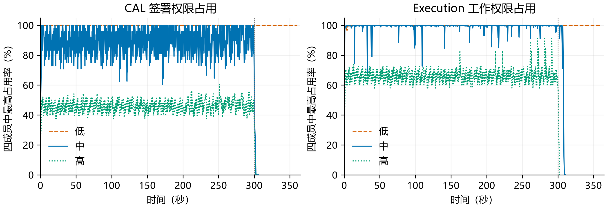
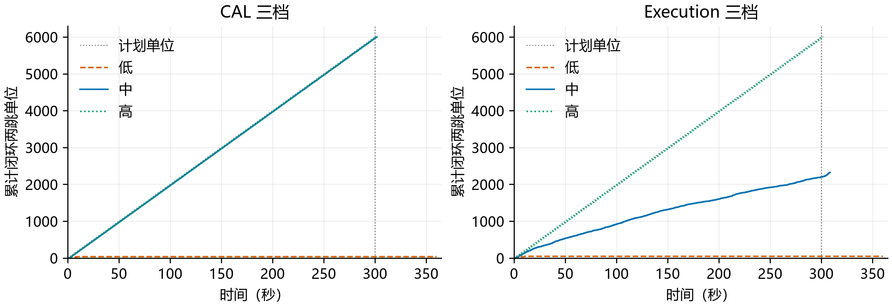

# E2 复测：用户自付 FUEL，组织不代付

本轮按实际业务要求重新实验：用户拥有充足的最终 FUEL UTXO，自行支付手续费；组织只承担 CAL 担保及工作权限。原 E2 的 `OrgReserve` 数据保留为代付场景，不再把其中的组织 FUEL 耗尽解释为本业务的瓶颈。

**本轮共完成 12 个案例，56,356 笔公共付款通过账本与费用审计，组织代付 FUEL 为零。** 这包含两组默认低预算下未能成证的请求，其残余占用单独列出；不能把公共付款核对通过解释为所有计划任务都已完成。

## 实现与实验条件

此次不是单纯给用户账户加余额。原快速路径只实现了组织代付，本轮接通协议已有的 `OwnerFinalUTXO`：用户签署费用输入、最大预留和退款地址；成员将费用与本金输入原子锁定；委员会实际消费用户 FUEL，产生找零和未用预留退款；钱包、成员正常跟块获得最终 FUEL 输出。组织代付仍可选，未删除原分支。详见[实现说明](../../implementation-owner-fuel-v4.md)。

- Mac Studio M4 Max，16 核、64 GB，同机多进程；周转矩阵使用实验内存模式，不测试崩溃恢复；两笔正常/赔付正确性控制保留真实区块存储，验证历史改写与重放。
- 单服务组织、四成员、每成员一个 Worker、四委员。两个付款钱包各有 6,000 个独立最终 FUEL 输入，每个 10,000 FUEL，总计 1.2 亿 FUEL。每笔最大预留 1,000，运行中不充值、不清锁。
- 不创建组织 FUEL 付款账户，删除组织 FUEL 与代付 Policy 授权。离线核对每笔实际费源，不能仅凭实验参数断言“用户付费”。节点报酬另行记账，组织不代付不等于组织没有 FUEL 收入。
- 固定 20 个两跳单位/秒，输入 300 秒、最多排空 60 秒，最多 128 个未完成单位。一个单位为 A→B→C 的两笔 100 CAL 付款；每次第二跳实际使用第一跳 TXCer。
- CAL 总授权为 3,600 / 7,200 / 14,400；Execution 为 1,122 / 2,244 / 4,488。四成员权限重叠，不相加当作真实本金。对应单成员权限分别为总授权的 2/3。
- 未被扫描的资源充足。正常父交易延迟 1 秒公开提交，对照只把 CAL 中档父延迟改为 3 秒；按委员会真实义务记录统计实际缺失输入比例。
- 自付每笔增加一个真实费用输入，并预留两个费用输出处理。父/子 Execution 为 26/36，旧代付为 17/27；每单位从 44 增至 62。沿用旧预算数值，因此“中档”不是已经校准为足够的承诺。
- 两跳均经过同一网关。与旧 E2 不构成仅改变费用来源的性能 A/B，不将结果外推为用户自付模式的最大 TPS。

## 完成量与权限周转

每组计划 6,000 个两跳单位。“启动”表示驱动已为单位发起工作，“闭环”要求两跳均完成成员收尾；未启动量反映预算等待与 128 单位窗口的背压，不能算作相同数量的委员会拒绝。

| 设置 | 总授权 | 启动单位 | 闭环单位 | 公共付款 | 未启动单位 | 未成证部分批准 | 实际缺失输入责任/成功子付款 |
| --- | ---: | ---: | ---: | ---: | ---: | ---: | ---: |
| CAL 低 | 3,600 | 166 | 38 | 102 | 5,834 | 58 | 29/38 |
| CAL 中 | 7,200 | 6,000 | 6,000 | 12,000 | 0 | 0 | 6,000/6,000 |
| CAL 高 | 14,400 | 6,000 | 6,000 | 12,000 | 0 | 0 | 5,999/6,000 |
| Execution 低 | 1,122 | 176 | 48 | 112 | 5,824 | 63 | 46/48 |
| Execution 中 | 2,244 | 2,325 | 2,325 | 4,650 | 3,675 | 0 | 1,078/2,325 |
| Execution 高 | 4,488 | 6,000 | 6,000 | 12,000 | 0 | 0 | 5,998/6,000 |
| CAL 中，父延迟 3 秒 | 7,200 | 1,792 | 1,792 | 3,584 | 4,208 | 0 | 913/1,792 |

本轮支持三个结论：

1. **用户自付成立。** 组织没有可用 FUEL 代付资金与授权，仍能完成上述公开付款，费用来自用户最终 UTXO。用户 FUEL 充分时，原先“组织手续费耗尽”的结论不适用。
2. **有限权限仍决定周转速度。** CAL 中/高档与 Execution 高档完成全部计划负载；Execution 中档只启动 2,325 个单位，但全部结清。CAL 中档父延迟改为 3 秒后只启动 1,792 个单位，也全部结清。后两者是在该负载下接入受限，不能称为永久卡死。
3. **低档局部批准问题仍存在。** CAL 低档和 Execution 低档虽已关闭全部公共付款，仍分别有 58、63 笔未成证部分批准。其权限和费用输入未因公共任务完成而自动释放；本轮没有换费用输入或清锁绕过这一现象。

同一用户自付路径、预算及父延迟下，另做默认关闭的单网关顺序取证控制：

| 低预算设置 | 默认并行闭环 | 顺序入口启动并全部闭环 | 顺序入口未启动 | 顺序入口部分批准残余 | 实际缺失输入责任/成功子付款 |
| --- | ---: | ---: | ---: | ---: | ---: |
| CAL 3,600 | 38 | 3,208 | 2,792 | 0 | 1,478/3,208 |
| Execution 1,122 | 48 | 2,743 | 3,257 | 0 | 1,398/2,743 |

控制组在结束时没有临时权限或未公共费用输入锁定残余，但仍没有接完全部计划负载。结果支持“单入口协调能缓解本案例的部分批准积累”，不能称作一般多网关问题已解决；其排队也使部分子交易执行时父交易已到，真实缺失责任比例不同。

实际担保工作量必须同时看：Execution 中档只有 1,078 / 2,325（约 46.4%）成功子付款在委员会执行时仍缺前置输出，其余父交易已经到达。不能用较低的公共占用断言相同担保业务更高效。

费用输入残余按唯一 UTXO 去重，不相加四成员副本：

| 默认并行低档 | 尚未公共消费、至少一个成员锁定 | 对应 FUEL | 钱包本地请求锁定 | 对应 FUEL | 已公共付款实际费用 |
| --- | ---: | ---: | ---: | ---: | ---: |
| CAL 低 | 58 个 | 580,000 | 128 个 | 1,280,000 | 9,588 |
| Execution 低 | 63 个 | 630,000 | 128 个 | 1,280,000 | 10,528 |

钱包列包含尚未获得任何成员批准的请求；两列有重叠，不能相加。它们不是已经扣除的费用。CAL 低档成员最高临时 CAL 占用为 2,400/2,400；Execution 低档最高临时 Execution 占用为 748/748。其余矩阵与顺序入口组最终临时占用及未公共费用输入锁定均归零。





图中 300 秒竖线为停止输入时点。占用曲线展示四成员中最高占用率，不把四份重叠权限合计；累计闭环要求父、子均完成成员收尾。

## 手续费审计

每笔费用输入为 10,000 FUEL，其中 9,000 立即找零、1,000 托管。以下金额按一个两跳单位统计：

| 路径 | 用户输入 | 立即找零 | 最大预留 | 实际费用 | 预留退款 | 节点报酬 | 销毁 | 组织代付 FUEL | CAL 赔付 |
| --- | ---: | ---: | ---: | ---: | ---: | ---: | ---: | ---: | ---: |
| 正常父子 | 20,000 | 18,000 | 2,000 | 188 | 1,812 | 168 | 20 | 0 | 0 |
| 子交易赔付后父交易迟到 | 20,000 | 18,000 | 2,000 | 193 | 1,807 | 173 | 20 | 0 | 100 |

单笔正常费用为 94：84 报酬、10 销毁、906 退款；一次赔付处理增加 5 FUEL，子付款退款为 901。两组各执行三次重复投递，账本没有重复收费或重复退款。赔付的 100 CAL 是组织真实净支出，不因收尾核销恢复成未损失本金。

每笔核对实际费用输入被消费、找零和退款的金额与身份、钱包最终退款状态；全局核对未花 FUEL、托管、报酬、销毁守恒。四委员状态一致。退款绑定原付费交易，父到账或赔付仅触发退款，不能把退款记到触发交易上。

未成证请求另报用户费用输入锁定：锁住不等于已支出，也不能未经协议依据直接解锁。本轮为每个计划付款预备独立费用输入，未出现用户 FUEL 余额耗尽；它不证明任意小钱包在大量部分批准下仍能继续支付。

## 证据、复现与边界

- [原始汇总](summary.csv)、[完整分析](analysis.json)、[证据清单](manifest.json)、[构建与源码指纹](source-provenance.json)。逐案例保存配置、采样、交易明细、账本和费用审计，大文件以 `.gz` 保存。
- `candidate-source.zip` 保存从基线 `5d8ff3fb7ea9a9496d16acee0080bf603491ac84` 编译实测二进制时的候选源码覆盖集；其后仅补充离线费用输入锁定统计和多退款测试，没有重编测量用业务二进制。
- [实现评审](gpt-review.json)与[矩阵结论评审](gpt-final-review.json)：重点核查真实费源、退款身份、多子退款、费用输入锁定，以及新旧工作量口径。
- 每个五分钟设置本轮运行一次，不提供置信区间。顺序入口仅单网关对照、默认关闭，不证明多网关活性或可维持最大 TPS。
- 本实验不扫描 Worker 倾斜与调配，不证明盈利、激励相容、无限期运行或远程网络性能。实际支出的用户手续费不可循环恢复，释放的只有未用预留及满足条件的组织权限。

从仓库根目录，在已安装 Go 1.27.1 的 macOS 环境运行，使用新的目录前缀避免覆盖证据：

```sh
python3 docs/experiments/owner-fuel-2026-09-23/reproduce.py --case probe --prefix fresh-owner-
python3 docs/experiments/owner-fuel-2026-09-23/reproduce.py --case fee --skip-build --prefix fresh-owner-
python3 docs/experiments/owner-fuel-2026-09-23/reproduce.py --case matrix --skip-build --prefix fresh-owner-
python3 docs/experiments/owner-fuel-2026-09-23/reproduce.py --case gate --skip-build --prefix fresh-owner-
python3 docs/experiments/owner-fuel-2026-09-23/analyze.py --prefix fresh-owner- --plot
```

绘图需要 matplotlib。正式项目检查（不把 `docs` 中历史源码副本当作主项目包）：

```sh
go test -tags=comet_v3 ./cmd/... ./internal/... ./protocol/... ./crypto/... ./finality/...
go test -race -tags=comet_v3 ./protocol ./internal/rules ./internal/member ./internal/wallet ./cmd/payctl
go vet -tags=comet_v3 ./cmd/... ./internal/... ./protocol/... ./crypto/... ./finality/...
```

测试覆盖费用输入错误/双花/不足时原子回滚、正常与赔付退款、同块父子、多子退款、无本地批准成员跟块、重复跟块、最终退款再消费及执行结果编码。正式项目包测试、上述 race 检查与 `go vet` 均通过，验证日志随证据保存。
