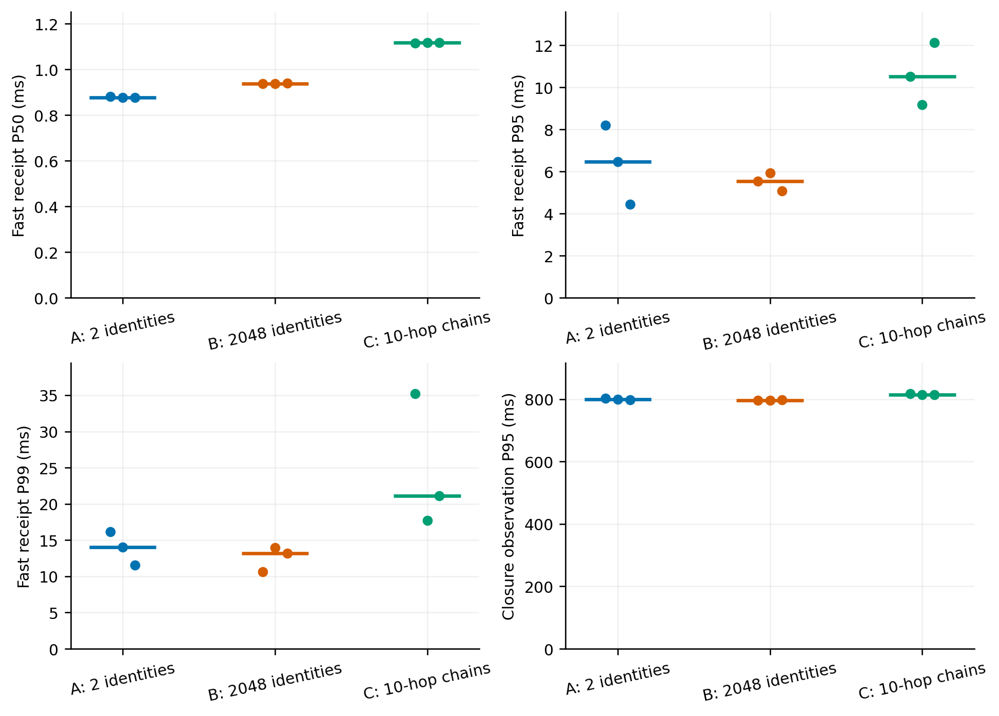
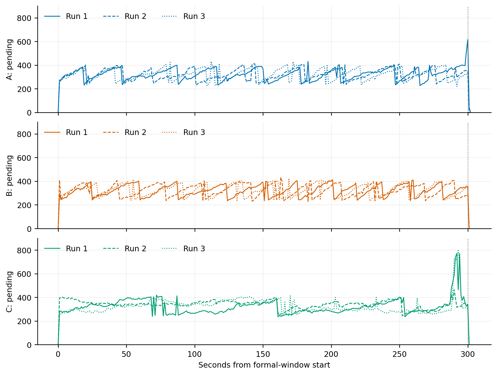
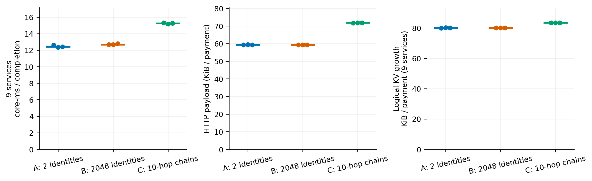
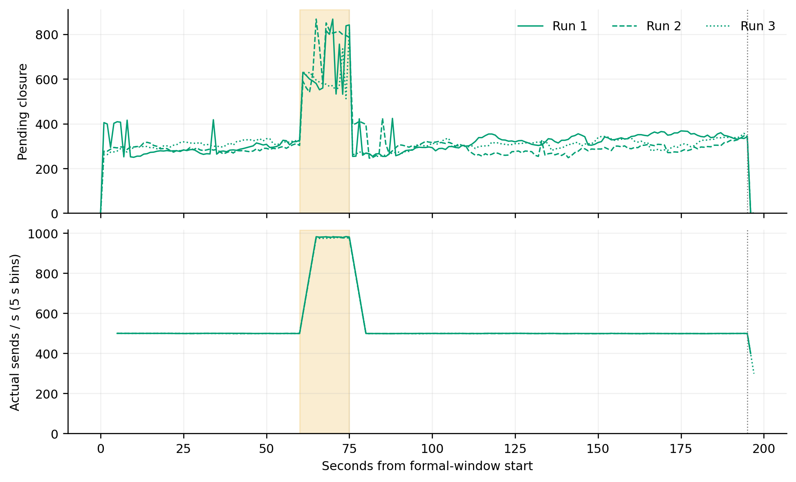

# E8：多钱包、真实续花与资源成本

> 已完成：9 轮五分钟主实验、3 轮突增实验，以及独立计时修正校验。主实验与突增共 **1,658,495 笔正式付款全部完成并通过审计**；预热、预跑及计时校验不混入这个样本数。

[完整统计表](TABLES.md) · [逐轮 CSV](per-run.csv) · [聚合数据](aggregate.json) · [实验方案](e8-workload-resource-plan-2026-09-24.md) · [评审记录](e8-workload-resource-review-2026-09-24.md)

## 结果与结论

本实验提供的是**同机固定工作点的负载敏感性与资源成本证据**。已发送付款都能完成，不代表接住了每个目标发送机会，也不代表历史状态不再增长。

| 配置 | 三轮正式付款 | 实际 TPS 范围 | 快速 P50 中位 / ms¹ | 快速 P95 中位 / ms¹ |
| --- | ---: | ---: | ---: | ---: |
| A：2 钱包，独立最终输入 | 449,062 | 498.36–499.28 | 0.876 | 6.471 |
| B：2048 钱包，独立最终输入 | 449,527 | 499.41–499.54 | 0.938 | 5.549 |
| C：2048 钱包，10 跳续花链 | 446,173 | 493.97–498.96 | 1.117 | 10.515 |

¹ 三轮分位数的中位数，不是合并所有付款计算的分位数。正式轮使用墙钟，存在下文说明的计时限制；这些数值仅作描述性观测，不据微小差异宣称显著改善。独立单调时钟校验中，C 的快速 P50 为 **1.105 ms**，但短校验不替代正式重复。



**真实续花得到业务审计验证。** C 三轮正式付款包含 **401,637 条指定父输出的后继消费**，均携带输入 TXCer；另有 **346 项**委员会执行时真正缺失父输出的责任，最终均正常关闭。墙钟匹配观测约 93% 后继在父最早 App.Commit 前发出，但没有记录时钟误差上界，不能把这个比例当严格因果证明。高证书使用量、低公共缺失量并不矛盾：父交易可能在子交易执行前、或同块更早位置得到处理。本实验不代表高缺父率或赔付压力测试。

**发送不足和尾部波动如实保留。** 所有轮次未触及 4096 总未完成任务上限，正式组无额外取证重试；不过 C1/C3 最后一分钟实际发送分别为 **473.30 / 474.55 TPS**。正式待办事件峰值最高 **938 笔**，停止新发后观测排空约 **0.50–1.11 秒**。没有据此宣称严格、无限期稳定承接 500 TPS，也未把晚段波动未经定位就归因于 GC 或数据库。



**续花具有可量化的资源代价。** 下表为三轮中位数，九服务包含 1 网关、4 成员、4 委员，驱动另计。

| 配置 | CPU core-ms / 闭环 | HTTP KiB / 付款 | 应用 KV 新增 KiB / 付款 | 九服务 RSS 峰值 GiB |
| --- | ---: | ---: | ---: | ---: |
| A | 12.42 | 59.34 | 80.02 | 52.62 |
| B | 12.67 | 59.32 | 80.05 | 52.09 |
| C | 15.24 | 71.83 | 83.44 | 53.54 |

C 相对 B 的窗口归一 CPU 约多 **20%**、HTTP 载荷约多 **21%**。这是依赖关系、输入证据与在线处理共同变化的成本，不能全归因于某次验签。2048 身份超过现有 1024 条描述符缓存容量；B/C 每笔在九服务中合计约产生九次实际描述符验签，A 预热后为零，说明结果并非全部来自两地址热缓存。交易、QC 等其他签名验证不在该描述符计数中。



初始九服务 RSS 约 **15.5–16.1 GiB**，正式峰值 **47.7–53.7 GiB**，另有驱动及操作系统开销。应用 KV 增长是九副本合计且包含保留历史，不是单个 UTXO 大小；RSS 也不是活堆。主机补充采样观察到压缩与 swap 使用，但该采样从 B1 期间才开始，不能据此判定某次尾延迟的原因。**待办可排空与历史内存持续增长是两件事；长期运行仍需要历史保留策略。**

**三轮突增均完成收尾。** 1000 TPS 目标阶段实际为 **976.20–981.33 TPS**；恢复 500 目标后实际为 **499.25–499.33 TPS**，待办回到原工作区间。第 75 秒前已发付款在恢复输入后约 **0.63–0.71 秒**被观察到全部闭环，新付款仍在继续。称为所测突增的承载表现，不称已证明超过服务能力的“过载恢复”。



## 实验问题

本实验检查两个问题：少量热地址上的表现能否推广到较多真实身份；多条真实依赖付款链并行时，需要多少额外处理与资源。它不搜索最高 TPS，不测试多机网络，也不等同于 2048 个独立钱包进程部署。

## 配置与复现

| 配置 | 活跃逻辑钱包 | CAL 输入 |
| --- | ---: | --- |
| A | 2 | 相互独立的已最终 UTXO |
| B | 2048 | 相互独立的已最终 UTXO |
| C | 2048 | 64 条活动 lane，逐条构造 10 跳续花链 |

同机 Mac Studio M4 Max（16 核、64 GB），单组织 1 网关、4 成员、4 委员，Go 1.27.1，`comet_v3`，节点内存实验后端、共享钱包 NoSync。沿用原签名校验、三票门槛、输入防重及原子事务；没有为 E8 调整缓存容量、共识参数或责任规则。

共同目标为 500 TPS，每轮正式输入 300 秒，各三次独立新创世运行，顺序 A/B/C、B/C/A、C/A/B。C 另做三轮 500 → 1000 → 500 TPS 突增，三个阶段为 60/15/120 秒。速率增加不自动等于过载。

每轮先连续运行 10.24 秒、以 200 TPS 预热，随后直接切换到正式速率；不先排空、不重置续花链，实际预热笔数单列。因此正式期可能包含预热父交易的后继及预热收尾。三组共用同一套共享 Store、跟块解析、64 个发送 worker、4096 个未完成任务上限。

三组在同类运行中准备相同数量的最终 CAL/FUEL 创世输出；每笔 100 CAL，并独立使用用户自己的最终 FUEL 输入。C 未使用的额外根保留。组织没有代付 FUEL 账户及对应授权，不启用动态补资、人工父延迟或串行取证。所有交易在线构造、签名及接收。

正式截止后不启动新逻辑付款；已发请求可以在原有 10 秒期限内重试，仅对 `QUORUM_UNAVAILABLE` 复用相同请求。这个错误码本身不证明具体原因。其次数计入报告，延迟包含重试。观察收尾最长 60 秒，未发、失败、未决均不得隐藏。发送器跳过已错过的时隙，不无限突发追赶。

C 每条 lane 完成一条链后，由末收款人使用另一笔预备最终 CAL 开始下一条链；旧链末输出不再消费，新链没有 UTXO 祖先依赖。这使预备用户费用输入的需求保持均衡，不额外补钱。初版相邻身份根选择会使部分钱包费用输入耗尽，已在正式 C 开始前修正；A/B 的支付路径没有改变。A1/B1 保留初版驱动，其余轮次记录修正版驱动指纹，所有节点二进制保持相同。

```sh
# 在 Mac/Linux 仓库根目录，Go 及 Python 3 可用
python3 docs/experiments/workload-resource-2026-09-24/reproduce.py \
  --label my-preflight --mode C --rate 500 --duration 30
# 已保存的通过案例会跳过采集、重新分析；不会覆盖历史证据
python3 docs/experiments/workload-resource-2026-09-24/suite.py
# 重新生成离线统计（不需启动节点）
python3 docs/experiments/workload-resource-2026-09-24/analyze.py \
  formal-a1 formal-b1 formal-c1 formal-b2 formal-c2 formal-a2 \
  formal-c3 formal-a3 formal-b3 burst-c1 burst-c2 burst-c3
python3 docs/experiments/workload-resource-2026-09-24/aggregate.py
python3 docs/experiments/workload-resource-2026-09-24/tables.py
python3 docs/experiments/workload-resource-2026-09-24/verify_evidence.py
# 图表另需 Python >= 3.10（本轮在 Windows Python 3.12 独立环境生成）
python3 -m pip install -r docs/experiments/workload-resource-2026-09-24/figures/requirements.txt
python3 docs/experiments/workload-resource-2026-09-24/figures/gen_fig_e8.py
```

复现需足够内存和临时磁盘。准备、停机导出与离线全账本审计在支付计时窗口外。新运行不得覆盖已有同名结果。初版源代码为 `5389f43`，C 根分配修正为 `efd82cb`，格式整理与强化回归为 `d4a5edc`。节点始终使用初版二进制；只有 `payctl` 在 C 修正后重新编译。逐轮 `build.json`、根目录 `build-initial.json` / `build-balanced.json` 记录实际哈希，不把编译器记录的基础提交误称为完整实验实现。初始 `source-manifest.json` 保留初版产生时的内容，其中“全部正式轮复用原二进制”的旧注释由本段及逐轮清单更正。

重新采集时，请通过 `reproduce.py --label 新名称` 逐轮运行，依照上述顺序、种子 124/225/326 和固定参数设置；C 使用 `--mode C`，突增另加 `--surge`。`analyze.py 新名称` 分析新案例。已提交九轮表格默认读取 `formal-*`，不要让新案例覆盖这些原始记录。

## 计量口径

| 指标 | 含义 |
| --- | --- |
| 快速到账 | 首次 HTTP 发送 → 收款逻辑钱包验证 TXCer 并完成本地接收事务 |
| 构造 | 开始在线构造 → 首次发送；不含离线生成密钥/创世输入池 |
| 计划→发送原始差值 | 正式轮存在时钟混用，保留原值但不当作排队耗时；跳过机会另列 |
| 公共观察 | 首次发送 → 共享钱包跟块后观察到成功；包含跟块延迟 |
| 成员收尾 | 首次发送 → 观察到四成员均已处理该付款 |
| 完整闭环观察 | 公共观察和四成员观察时间的最大值；不是纯委员会执行时间 |
| 活动未完成 | 正式付款队列中已发送但尚未完整闭环的付款；用逐笔时戳重建峰值和按秒曲线，在线另采样含预热尾部的最老年龄 |
| CPU | 各进程累计 CPU 时间差 / 同一采样窗口内完整闭环数；九服务与驱动分别列出 |
| HTTP 载荷 | 各服务实际读请求体、写响应体各一次；含重复请求、INSTALL、跟块及观察查询，不含 HTTP 头、P2P 或系统流量 |
| 逻辑状态增长 | 初末应用内存后端 KV 条目及字节差，含预热；不含 CometBFT 内存块存储和运行时缓存，不是实际磁盘写入量 |
| RSS | 每秒采样驻留内存；九服务总峰值取同时刻之和，不把各进程不同时间的峰值相加 |

跨进程使用该主机墙钟关联。表中“父 Commit 前首发”是父所在高度最早应用 Commit 与首发的墙钟匹配观测，受下述计时限制，不能当作无误差的事件先后证明；`parent_commit_unknown=0` 仅表示记录均可匹配。钱包仍携带 TXCer 不等于父尚未提交，委员会执行时缺失父输出又是另一项。C 自然发生这些情况，不人为制造缺父来抬高比例。

CPU 与 HTTP 为观测窗口平均，预热切换时的后台尾部和轮询边界可能混入，不能称精确逐笔成本。计数校准只有一组开关对照，不证明零开销。三轮用运行间范围及中位数，不把同一轮大量付款当成独立实验重复。

正式付款按计划时隙所属阶段划分，实际发送量只计其中已发出的付款；首发截止检查、漏发机会与实际发送滞后同时保留。CPU 采样直到驱动退出，驱动自身的报告序列化也可能包含在其尾段成本内，不算作节点协议 CPU。

### 计时限制与修正

离线复核发现，原驱动按 Go 单调时钟推进时隙，却把由起点投影的 `ScheduledNS` 与当前墙钟 `SentNS` 做差：多轮出现负值，C3 的差值中位约 40 ms。具体系统校时原因未经确诊。该差值不用于排队归因，没有截零或删除异常记录；C3 的 20 笔截止前构造、未首发任务也单列，不能全部归因于系统容量。

原正式轮其他时间分位数同样来自墙钟。它们保留为**描述性观测**，不用于细小延迟差异的显著性论证；未发现负间隔也不构成时钟误差上界。真实付款数、指定输入消费、审计、累计资源计数仍有独立价值，时间窗口及归一化值按原口径公开。

后续提交 `bb65af6` 仅修正驱动计量：同进程耗时保存 `Time.Sub`，首发截止使用单调 `endTime`，墙钟继续用于日志关联。独立 `timing-c500` 短校验使用 TimingVersion 2，不并入九轮正式或三轮突增；它不能事后恢复旧轮未记录的单调时间。原轮二进制、原始异常值和新旧口径分别保留。

短校验 30 秒正式输入完成 **14,993/14,993** 笔，单调快速 P50/P95 为 **1.104708/6.090917 ms**，单调计划→发送 P50/P95 为 **0.427291/0.691125 ms**；该轮墙钟快速耗时与单调耗时最大绝对差为 0.001541 ms。这只描述校验轮，不能作为旧正式轮的误差上界。

## 正确性与证据

每轮停机后核对四委员状态哈希、CAL/FUEL 守恒、用户费用、输入唯一消费、成功输出及退款落入钱包、真实后继消费指定父输出、只有实际链尾未消费、所有签署成员原始扣账已核销、公共责任与 outbox 排空。截止时不足 10 跳的链只审计实际发送前缀，不要求不存在的后续交易上链。

原始证据按案例目录保存：`configuration.json`、`build.json`、`resources.jsonl`、初末计数、`reports/e8-report.json.gz`、审计报告及日志。原始输出不包含私钥或数据库。`summary.json`、`timeline.csv`、`per-run.csv` 和 `aggregate.json` 可由脚本重建。

`evidence-manifest.json` 给出逐文件 SHA-256。`verify_evidence.py` 核对 12 个矩阵案例及独立计时校验的摘要/审计数量、四委员状态一致与待办归零。`verification.log` 和 `post-complete.json` 记录 `go test -tags=comet_v3 ./...`、`go vet -tags=comet_v3 ./...` 通过后的校验流程；分析单元测试与图表目视检查也已完成。

## 预跑与实现校准

- `probe-b`：2048 身份的 100 TPS 五秒控制通过。
- `probe-c`：最初驱动未复用已有暂时取证失败重试，3 笔返回 `QUORUM_UNAVAILABLE`；保留失败记录。之后复用同请求有界重试，`probe-c-retry` 全部通过。不能仅凭错误码把原因定为成员跟块落后。
- `cal-c500`：未开始付款，因新建夹具漏拷 Comet 节点密钥而启动失败；修正为复制从未启动的模板后，`cal-c500-v2` 通过。
- `cal-a500`、`cal-b500`、`cal-c500-v2`：三配置的 30 秒预跑通过，因此选定共同 500 TPS 工作点，不继续搜索峰值。
- `cal-b500-off`：关闭计数的校准，实际发送率与中位延迟接近开启组，尾延迟存在波动。全部正式轮统一开启同样计数。

以上均不并入正式矩阵。尚未实施的网络/多组织实验 E7、输入输出数量扫描，以及生产持久化恢复，不由 E8 代替。
