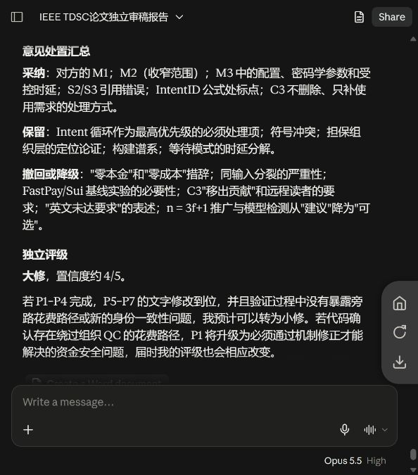
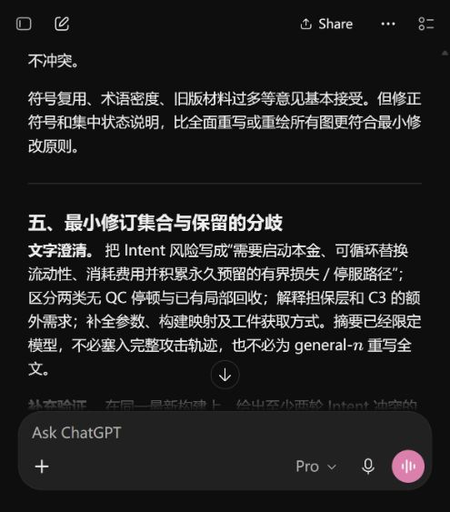

# 最新论文：Claude / GPT 独立评审与交叉复核

日期：2026-10-03。论文版本 9879f64，相关代码补丁 bf71c4d。两位收到完全相同的英文正文及补充 PDF；文件 SHA256 见 submission.json。Claude 页面选择 Opus 5.5 High，入场时 session 1%、week 0%。GPT 页面显示 Pro。

## 过程与材料

1. Claude 首先仅收到正文、补充与中立评审请求，没有先看 GPT 的意见。
2. 两份独立报告完整互送，并要求核算反例、复核范围、区分必要修改与可选扩展，不要求强行一致。
3. 本轮只审稿及整理证据；没有运行新代码复现，没有修改代码、协议或论文，也没有推送。

- [Claude 独立报告](claude-independent-review.md)
- [GPT 独立报告](gpt-independent-review.md)
- [Claude 交叉复核](claude-cross-review.md)
- [GPT 交叉复核](gpt-cross-review.md)
- [给 Claude 的交叉请求](cross-to-claude.txt)
- [给 GPT 的交叉请求](cross-to-gpt.txt)
- [Claude 对话](https://claudez.yuehanxai.com/chat/9440ee11-9e4e-435e-aa26-2ab1f2c0159f)
- [GPT 对话](https://chatgpt.com/c/6ac08015-9730-83ec-8e11-e504a8ce7a82)

## 最终判断

两位均维持 Major Revision，置信度约 0.8。这是辅助模型的模拟评审，不是期刊决定，也不是代码安全认证。双方认可核心直接责任机制、隐藏证书资金覆盖、守恒及条件化的延迟中性论证，并认可连续支付和暂停适配实验在声明范围内的价值。没有据这些新轨迹推翻资金覆盖或守恒定理。

## 交叉复核后的变化

| 事项 | 独立意见差异 | 复核后的结果 |
|---|---|---|
| Intent 冲突循环 | Claude 更强调重复损失，初用“零本金”；GPT 原先强调已披露的一次性风险 | Claude 撤回零本金/零成本；GPT 接受可利用新输出继续循环。需启动资金、费用和可用路由；累计损失受 grant 上界约束，可能在储备清空前先停服。尚待当前代码复现。 |
| 无 QC 停顿 | Claude 提同输入2/2冲突；GPT 提四笔独立交易的额度碎片化 | 两类不同；局部回收仅处理有成功公开赢家的情形。Claude 采纳合法并发碎片化为重点。 |
| C3 | Claude 初评建议删除或新增更强读者需求 | Claude 撤回强制删除及远程读者要求。可保留授权历史表示/完整身份保持贡献，需具体使用需求及当前版本功能证据，不能仅靠7–12%读取收益说明必要性。 |
| 范围扩大 | Claude 初评建议一般规模、重配置等 | 双方不把它们作为硬性要求。固定成员与状态不回滚已在正文明确。 |
| 写作 | Claude 初评措辞较重 | 校准为不需全面重写；修符号复用、术语密度、状态维度和补充引用。 |

## 建议的最小后续路径（尚未执行）

1. **核实两类资源轨迹。** 在当前构建核实至少两轮 Intent 冲突的 CAL/FUEL、冻结输入、新输出、义务、备付余额和各成员预留；核实独立合法交易的额度碎片化及补资恢复。保留同输入分裂与有公开赢家回收的对照；已有定向测试应先复用。
2. **补组合证据。** 核对最新构建中补偿、偿还、表示、落后副本追赶/重启的组合；检查原始材料回放、完整 BlockID、经济效果至多一次、前缀读取和 cursor/额度更新原子性。先盘点已有证据，不把未知当已发生故障。
3. **完善可复现信息。** 功能—构建—实验映射，实际储备/grant/Worker、峰值与永久预留、密码学实例参数、工件入口；用逐笔已有记录分解等待基线中的应用提交与观察延迟。旧性能数字保持原版本标签。
4. **收拢论文表述。** 解释担保层与委员会证书最终性方案的目标差异；C3明确具体历史字节/身份接口；解释有限额度运行条件及对抗性经济损失；统一状态与符号。

机制修改不是双方的无条件要求。若要主张对任意客户无损，或额度停顿后自主恢复，则必须设计、验证更强机制。更改 Intent 作用域会改变幂等语义，没收输入需新的授权与资金规则，不能为了审稿直接采用。

## 仍保留的差异与我的判断

GPT 仍将当前构建在实际成员认证和委员会通信路径上的非零时延/单故障小实验列为最低验证；Claude 允许进一步限定单机时延主张作为替代。Claude 对 Intent 机制调整态度更积极，但最终也允许量化风险、运行条件与验证。

我认为应先完成代码轨迹确认和已有证据映射，再决定最小新增测试。现有原文 model.tex 已明确固定四成员与静态腐化；security.tex 已披露 Intent 失败及担保损失，不能声称完全没有说明。真正新增的关注点是可重复循环的经济账目，以及无冲突并发之后的额度停顿。不得把两位模型的一致意见当作复现结果，也不应将建议全部累加为开发需求。

GPT 对重复循环补充了重要条件：每轮配对交易保持同一 Subject；后继使用新 Intent；辅助组织与费用资源充足；最后输出应路由到仍有服务能力的组织。截止期控制扣款，未必控制下一轮启动。冻结 FUEL 是整个输入的不可用状态，不能与实际已扣手续费混为一谈。

## 截图

