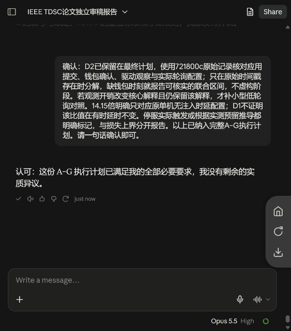
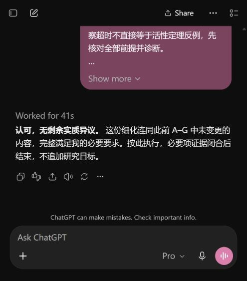

# 完整大修方案：双方交换与最终确认

本轮仅制定计划，未执行代码修改、新实验或论文修订。

- [统一实施方案](../../../../superpowers/plans/2026-10-03-complete-paper-major-revision.md)
- [发送Claude的完整材料](to-claude.txt)
- [发送GPT的完整材料](to-gpt.txt)
- [Claude完整方案](claude-final-plan.md)
- [GPT完整方案](gpt-final-plan.md)
- [统一口径确认问题](closure-confirmation-prompt.txt)
- [Claude条件确认与更正](claude-confirmation.md)
- [Claude最终确认](claude-final-confirmation.md)
- [GPT最终确认](gpt-confirmation.md)

Claude要求保留D2等待基线解释。统一方案已保留；缺少时间戳不虚构分解，14.15倍仅对应原单机无注入时延配置，停服推导与损失上界分开。补充确认后，Claude与GPT均明确无剩余实质异议。

最终范围采用12轮四条件的小型验证；三项贡献保留；真实模型内缺陷触发最小修复；以可定位证据逐项关闭。双方认可表示对实施路径的意见一致，不表示实验已经通过或保证录用。

